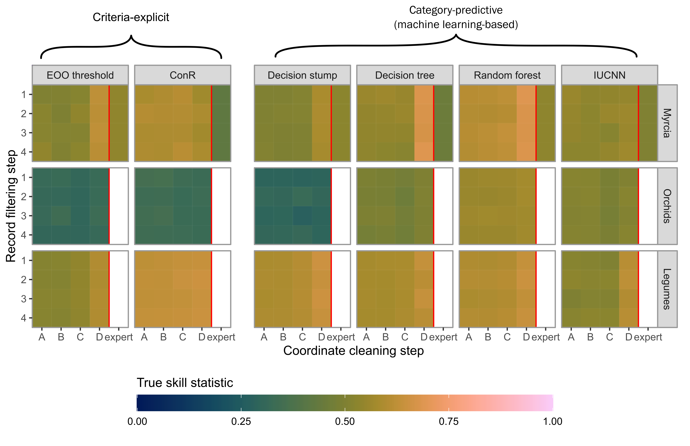
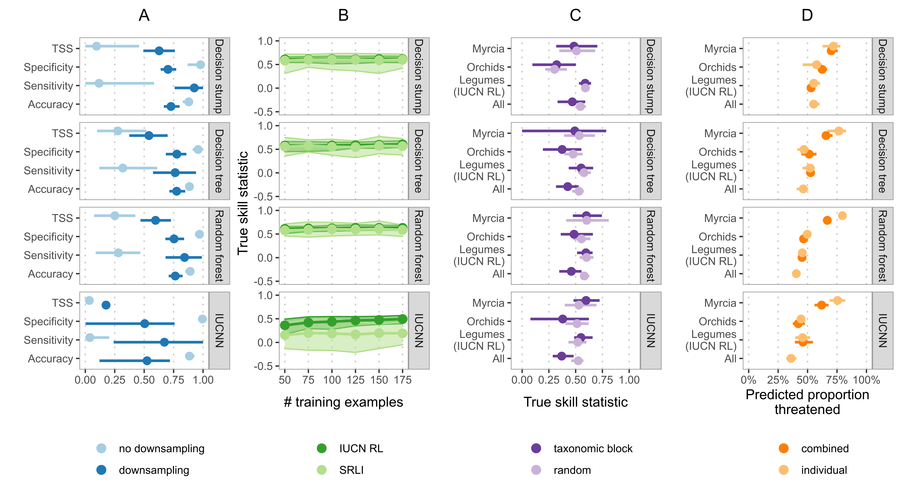
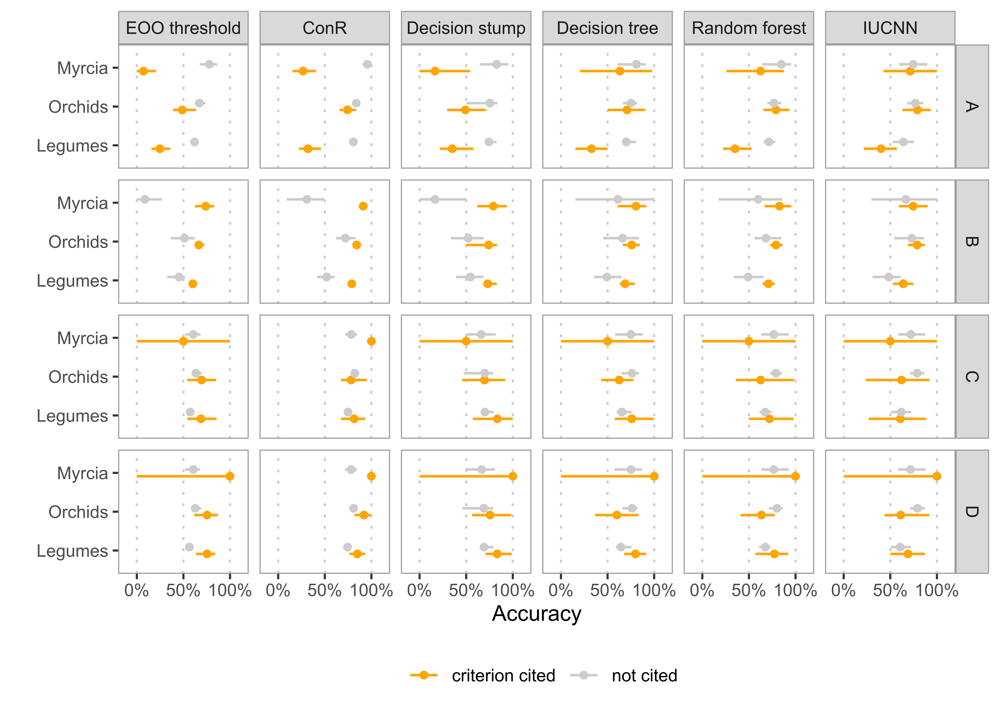

```{r setup, include=FALSE}
knitr::opts_chunk$set(echo=FALSE)
```

```{r libraries, include=FALSE}
library(here)
library(vroom)
library(tibble)
```

# Abstract

Assessing species’ extinction risk is vital to setting conservation priorities. However, assessment endeavours like the IUCN Red List of Threatened Species have significant gaps in coverage of some taxonomic groups. Automated assessment (AA) methods are gaining popularity to fill these gaps, leveraging improvements in computing and digitally-available information. Choices made in developing, using, and reporting AA methods could hinder successful adoption or lead to poor allocation of conservation resources.

We explored how choice of data-cleaning, taxonomic group, training sample, and automation method affected performance of threat status predictions for groups of plant species. We used occurrence records from GBIF to generate assessments for species in three taxonomic groups using six different occurrence-based AA methods. We measured each method’s performance and coverage after applying increasingly stringent cleaning to occurrence data.

Automatically cleaned data from GBIF yielded comparable performance to occurrence records cleaned manually by experts. However, all types of data-cleaning removed species and limited the coverage of automated assessments. Overall, machine-learning-based methods performed well on all taxonomic groups, even with minimal data-cleaning.

Results suggest a machine-learning-based method on minimally cleaned data offers the best compromise between performance and species coverage. However, optimal data-cleaning, training sample, and automation methods depend on the study group, intended applications and expertise. We recommend evaluating new AA methods across multiple groups and providing additional context with extinction risk predictions so users can make informed decisions.

# Keywords
IUCN Red List, machine learning, automation, biodiversity conservation

# Introduction

Identifying and documenting species at risk of extinction is critical in setting priorities and acting to protect biodiversity. The IUCN Red List of Threatened Species (hereafter Red List), the most widely accepted framework for assessing species’ global extinction risk, covers  some groups completely (e.g. birds) but only ~15% of vascular plant species [@iucn_table_2021]. Gaps in extinction risk knowledge may lead to inefficient or inappropriate conservation resource allocation. Automated assessments (AA) based on occurrence records from natural history collections and digital resources can help close assessment gaps [@nic_lughadha_extinction_2020]. Growing recognition of the imperative to accelerate extinction risk assessments [@albani_rocchetti_reversing_2020; @bachman_progress_2019], advances in digitisation of natural history collections [@paton_plant_2020], and widening availability of biodiversity data have stimulated development of AA methods. However, systematic exploration of methods is necessary for their effective application.

Assessing  species for the Red List involves gathering data and calculating metrics to apply one or more of five quantitative criteria [@iucn_iucn_2012] that relate to reductions in population size (A), geographic range size and fragmentation (B), small and declining population size (C), very small and restricted populations (D), and quantitative analysis (E). 

AA methods can be organised into two main approaches, those based on calculating parameters to which Red List criteria can be directly applied, and those using machine-learning or statistical modelling to predict Red List categories from chosen correlates of extinction risk. A recent review summarises these approaches as criteria-explicit and category-predictive, respectively [@cazalis_bridging_2022]. A range of methods has been developed for different taxa that calculate parameters and predictors from information including species ranges [@bland_predicting_2015; @bird_integrating_2012], occurrence records [@dauby_conr_2017; @zizka_automated_2020], known threats and human pressure [@di_marco_changes_2018; @greenville_simultaneously_2021], and species characteristics [@pelletier_predicting_2018; @safi_phylogenetic_2010]. Although most methods use parameters or predictors relating to range size (criterion B) and/or population decline (criterion A), methods exist that apply all criteria except E [@santini_applying_2019; @visconti_projecting_2016].

For plants, occurrence records held in natural history collections and digital resources represent the most readily available distribution data [@nic_lughadha_use_2019]. Therefore, most AA methods developed for plants use parameters or predictors calculated from occurrence records [@cazalis_bridging_2022]. These parameter and predictors are mostly associated with range size (criterion B), although some include measures or correlates of population size (criterion A; [@zizka_iucnn_2022; @stevart_third_2019]). 

Accessible tools employing AA methods include criteria-explicit rCAT [@moat_rcat_2020], rapidLC [@bachman_rapid_2020], ConR [@dauby_conr_2017], and neural network-based category-predictive IUCNN [@zizka_iucnn_2022]. Automated methods have been applied to large datasets, including continental-scale preliminary assessment of 22,036 species of tropical African plants [@stevart_third_2019], automated assessment of 13,910 orchid species [@zizka_automated_2020], and automated assessments for over 150,000 land plants [@pelletier_predicting_2018]. 

These studies recognise limitations in their approaches while, nonetheless, suggesting their new method can inform conservation prioritisation. For example, Stévart et al. [-@stevart_third_2019] propose areas of High Conservation Value, and Pelletier et al. [-@pelletier_predicting_2018] propose global “geographic regions with the highest need of conservation efforts”. However, complete information required for potential users to evaluate method performance, and the resulting conservation priorities, is not consistently reported [@walker_caution_2020].

Given these high-stakes applications of AA methods, thorough consideration of their benefits and limitations seems prudent. Potential misinterpretation [@wearn_responsible_2019] of AA methods can be avoided through full exploration and reporting of choices by method developers. Similarly, practitioners wishing to adopt automated methods need clear guidelines about method choice and appropriate use.

Specifically, four questions central to adoption and successful use of AA methods are:

1.	How clean must occurrence data be? Quality issues affecting occurrence records in online databases are well-documented [@meyer_multidimensional_2016; @panter_clean_2020; @paton_plant_2020]. Species occurrences are, therefore, manually checked during Red List assessments, requiring significant time investment, especially concerning georeferencing,. Occurrence-based AA methods typically use automated cleaning on digitally-available records to save time, but overly-strict cleaning could limit benefits of automated assessments. Automated cleaning is more important for criteria-explicit than category-predictive methods [@zizka_automated_2020] with variable effect across taxa for criteria-explicit methods [@zizka_no_2020].

2.	Which sample of assessments are most effective for training and evaluating AA methods? A sample of species with published Red List assessments is needed to measure AA method performance and train machine-learning-based methods. To maximise sample size, analyses usually use all assessed species in a study group. However, given the historically non-systematic choice of species for assessment [@nic_lughadha_extinction_2020], assessed species may not represent diversity within a group. Furthermore, species assessed in each Red List category are imbalanced, potentially causing problems for machine-learning models. Previous studies addressed these issues by using a random subset of species assessed for the Sampled Red List Index (SRLI; [@zizka_automated_2020]) or correcting imbalances through downsampling [@pelletier_predicting_2018]. 

3.	Do individual IUCN criteria need to be considered? Most plant assessments apply criterion B [@nic_lughadha_use_2019], using measures of species distribution calculated from occurrence records. Similarly, most occurrence-based AA methods developed for plants use parameters and predictors related to criterion B. It remains unclear whether occurrence-based AA methods can predict the status of species assessed under all criteria equally well.

4.	When should one AA method be used over another? Both criteria-explicit and category-predictive methods can generate predictions with high correspondence to manual Red List assessments, but each offers distinct advantages. Criteria-explicit methods make decisions easier to interpret and troubleshoot than machine-learning techniques like random forests or neural networks. Conversely, machine-learning methods may be more robust to unclean data. The desired balance between predictive accuracy, ease of use, and interpretability may vary depending on available data, species group, and intended users.

Here, we systematically investigate effects of data-cleaning, assessment sample choice, and AA method by applying six different occurrence-based methods to generate preliminary assessments for three groups of flowering plants with distinct occurrence record profiles. We compare performance of these methods on digitally-available occurrence data using different levels of automated cleaning and a database of manually-cleaned occurrences. We examine how choices concerning training data and downsampling affect performance of machine-learning methods. We develop evidence-based recommendations for using AA methods and highlight important unanswered questions.

# Methods

## Data compilation and cleaning

We chose three species groups to evaluate effects and performance of choices in automated assessment processes. We selected groups with distinct geographic and taxonomic profiles and collection histories: 

*	The neotropical genus *Myrcia* (~750 spp; family Myrtaceae). *Myrcia* species are notoriously difficult to identify, so records in digital resources, like GBIF, may contain significant taxonomic errors. After decades/centuries of taxonomic impediment, molecular analysis and collaborative systematics are enabling a monographic approach. Access to a monographer’s database of *Myrcia* specimens allowed comparison of manual and automatic data collection and cleaning.

*	The family Orchidaceae (~30,000 spp, orchids). Only ~5% of orchid species are assessed on the Red List, so rapid preliminary assessments could help focus resources on potentially threatened species. Furthermore, a previous study on Orchidaceae [@zizka_automated_2020], allows direct comparison of results.

*	The family Leguminosae (~22,000 spp, legumes). Another large family, but relatively well-understood taxonomically and well-documented (e.g. [@lewis_legumes_2005]). Legumes are well-represented in the Sampled Red List Index (SRLI), allowing us to compare the effect of training and evaluating AA methods on a random sample against all assessed legumes on the Red List.

We obtained checklists of accepted species for all three groups from the World Checklist of Vascular Plants [@govaerts_world_2021]. *Myrcia* taxonomy occasionally differs due to ongoing revisionary study (e.g., Lima-Santos et al., unpublished data).

### Species assessments

We downloaded published assessments for the three species groups from the Red List [@iucn_iucn_2021] and supplemented the *Myrcia* dataset with 23 unpublished assessments completed by Kew’s Plant Assessment Unit. We matched assessment names to WCVP and updated accepted names of assessments matched to homotypic synonyms. We removed all assessments matched to non-homotypic synonyms, unmatchable assessments, and those that matched species outside our accepted species lists.

### Occurrence records

We downloaded occurrence records from GBIF for the entire families to which our groups belong (*Myrcia*: [@gbiforg_gbif_nodate]; orchids: [@gbiforg_gbif_nodate-1]; legumes: [@gbiforg_gbif_nodate-2]) and matched taxon names of these occurrences to WCVP taxonomy (see Supplementary Materials).

For *Myrcia*, we retrieved expert-verified occurrence records from a monographer’s database of *Myrcia* s.l. (E. Lucas, unpublished data).

### Occurrence record cleaning

To address our first question, we passed each set of occurrences through automated cleaning steps using two approaches: filtering records lacking voucher specimens or representing duplicates, and removing records based on possibly erroneous coordinates.

```{r cleaning-steps}
cleaning_steps <-
  tribble(~`Step`, ~`Description`,
          "1", "No filtering of occurrence records",
          "2", "Keep only records based on preserved specimens",
          "3", "Keep one of every record at exactly the same coordinates for each species",
          "4", "Apply both filter step 2 and 3",
          "A", "No geography-based cleaning",
          "B", "Remove occurrence records with coordinates at (0, 0)",
          "C", "Remove occurrence records in the sea, at equal longitude and latitude, at country centroids, and at identified institutions",
          "D", "Remove occurrence records outside each species native range as listed in POWO")

cleaning_steps %>%
  knitr::kable(
    caption="A description of each filtering and coordinate cleaning step. Filtering steps were applied separately, while coordinate cleaning steps were applied consecutively (i.e. step C was applied to a dataset already cleaned by step B)."
  )
```

We applied filters to test whether removing occurrences not based on preserved specimens or removing duplicated occurrences affected extinction risk prediction. The combination of these filters led to four different filter levels (Table 1).

We chose coordinate cleaning steps based on approaches of other AA methods studies (e.g., [@bachman_rapid_2020]), two of which (B and C) are implemented in the CoordinateCleaner package [@zizka_coordinatecleaner_2019]. We applied each step sequentially to give increasing levels of coordinate cleaning (Table 1).

We passed all occurrence datasets, except *Myrcia* monographic database occurrences, through all permutations of these filtering and cleaning steps, generating 16 occurrence records sets for each species group, plus an additional set of occurrences from the *Myrcia* monographic database.

## Method training and evaluation

We generated extinction risk predictions for species groups from six different AA methods (Table 2) using sets of parameters and predictors calculated from each of 16 cleaned occurrence datasets, and the monographic *Myrcia* dataset. We calculated these predictors (Appendix S9) for each species represented in the cleaned occurrence dataset, using the coordinates of the occurrences downloaded from GBIF. See Supplementary Methods for a full description of predictor preparation.

```{r methods-info}
methods_info <-
  tribble(~`Method`, ~`Type`, ~`Description`, ~`Predictors`, ~`Interpretation`, ~`Implementation notes`,
          "EOO threshold", "Criteria-explicit", "The IUCN criterion B threshold for the extent of occurrence (EOO) of threatened species (EOO <20,000 km$^2$).", "EOO", "-", "Calculated using rCAT [@moat_rcat_2020], threshold applied in our own implementation.",
          "ConR", "Criteria-explicit", "The IUCN criterion B thresholds on EOO, area of occupancy (AOO), and number of threat-defined locations as calculated by the ConR package.", "EOO, AOO, number of locations", "-", "Calculated using ConR [@dauby_conr_2017], thresholds applied in our own implementation following ConR.",
          "Decision stump", "Category-predictive (machine-learning-based)", "A decision tree with a single split on species’ EOO. Requires more expertise than IUCN threshold but is still readily interpretable.", "EOO", "Inspecting the learned classification boundary.", "Using rpart as part of the tidymodels [@kuhn_tidymodels_2020] interface.",
          "Decision tree", "Category-predictive (machine-learning-based)", "A decision tree model limited to a maximum of 5 splits and using predictors including EOO and measures of species’ environment and exposure to threats. More splits and predictors than the decision stump make this method harder to use and understand.", "EOO, latitude of range centroid, human population density (HPD), human footprint index (HFI), forest loss, elevation, precipitation in the driest quarter, average annual temperature.", "Visualising the splits in the decision tree as a flow chart.", "Using rpart as part of the tidymodels [@kuhn_tidymodels_2020] interface.",
          "Random forest", "Category-predictive (machine-learning-based)", "A random forest model using the same set of predictors as the decision tree. This method is hardest to interpret and use but has shown good performance in previous studies predicting extinction risk [@bland_predicting_2015; @darrah_using_2017; @nic_lughadha_use_2019; @pelletier_predicting_2018].",	"As above.", "Calculating SHapely Additive exPlanations (SHAP; [@lundberg_unified_2017]) to give the individual contribution of each predictor to each prediction.", "Using randomForest as part of the tidymodels [@kuhn_tidymodels_2020] interface.",
          "IUCNN", "Category-predictive (machine-learning-based)", "A densely-connected neural network built and trained as implemented by the IUCNN package [@zizka_iucnn_2022] and using the same set of predictors as the decision tree. This method is hard to interpret, like the random forest, but has also shown good performance in a previous study [@zizka_iucnn_2022].", "As above.", "As above.", "Adapted to our workflow following the implementation in the IUCNN [@zizka_iucnn_2022] package."
  )

methods_info %>%
  knitr::kable(
    caption="Description of the AA methods investigated; for a full description of predictors used and their data sources, see Appendix S9."
  )
```

We compared two criteria-explicit methods: one using the IUCN threshold for EOO, the other using the IUCN thresholds for EOO, AOO, and number of locations calculated by ConR. The other four methods investigated were machine-learning-based category-predictive methods using some subset of 8 predictors (EOO, latitude of range centroid, human population density, human footprint, forest loss, mean annual temperature, and precipitation in the driest quarter): a decision stump with EOO as the only predictor, a decision tree limited to 5 splits on all predictors, a random forest model using all predictors, and a densely connected neural network (following the implementation used in IUCNN) using all predictors.

The EOO threshold method, decision stump, decision tree, and random forest provide a progression from simple to use and interpret, to a “black-box” machine-learning method. ConR and IUCNN provide accessible implementations for users. All models were trained and evaluated using the tidymodels framework, including ConR and IUCNN, which we adapted to fit our workflow.

We grouped species threat categories to reduce imbalance between classes. Following IUCN definitions, we grouped the Critically Endangered, Endangered, and Vulnerable categories as threatened [@iucn_iucn_2012], and grouped Near Threatened and Least Concern categories as non-threatened. We treated Data Deficient species as unassessed, generating predictions for them. We excluded Extinct and Extinct in the Wild species.

We used 10 repeats of 5-fold cross-validation to train and evaluate our decision stump, decision tree, random forest, and neural network models. Both the random forest and neural network models have hyperparameters, which we tuned using nested cross-validation (see Supplementary Methods for a full description). We used 50 bootstrap resamples of the species that had assessments to evaluate our criteria-explicit methods. 

We measured the accuracy of all methods, as well as their sensitivity (proportion of threatened species correctly identified), specificity (proportion of not threatened species identified correctly), and true skill statistic (TSS), which balances the sensitivity and specificity (see Supplementary Methods for definitions). We also calculated the coverage of each cleaned occurrence dataset as the proportion of each species group for which a prediction could be made, i.e. the proportion of species with at least one occurrence record.

## Analyses

Our analyses aimed at answering the following questions:

### How clean must occurrence data be?

We compared the performance of each of the six AA methods, across our three taxonomic groups, on each of the 16 cleaned occurrence datasets. For *Myrcia*, we compared the performance after the automated cleaning steps to the performance on occurrences from the monographic database.

### Which sample of assessments are most effective for training and evaluating AA methods? 

We examined three aspects of the training and evaluation sample: representativeness, size, and balance of threatened to non-threatened species. We addressed representativeness by comparing our AA methods’ performance on all assessed legumes to performance on legumes assessed for SRLI, a sample designed to represent legume diversity, taxonomically and geographically. Species are often assessed for the Red List as part of an effort focusing on a particular taxon or geographic area [@nic_lughadha_extinction_2020], leaving entire groups of plants unassessed. Random cross-validation may give a biased estimate of performance in this case. We, therefore, additionally compared performance of all machine-learning-based methods evaluated by taxonomic block cross-validation (see Supplementary Methods for a full description).

We evaluated sample size effects when training our three machine-learning-based AA methods by splitting our datasets into 5 cross-validation folds, training our models on subsamples of training data, and measuring subsequent performance on validation sets. We increased subsample size from 50 to 175 species in increments of 25. We also evaluated each model’s performance with a training set combining all three datasets.

We assessed the effect of sample balance on our three machine-learning-based AA methods by downsampling training sets to balance numbers of threatened and non-threatened species, as Pelletier et al. [-@pelletier_predicting_2018] did.

### Do individual IUCN criteria need to be considered?

IUCN Red List assessments list the criteria to trigger threatened status.We compared the ability of each method to identify threatened species (sensitivity) citing each criterion A-D. No assessments in our dataset cited criterion E.

### When should one AA method be used over another?

As well as comparing performance of our chosen AA methods, we compared the interpretability of the machine-learning-based methods using approaches outlined in Table 2. For the “black-box” machine-learning methods, random forest and IUCNN, we calculated SHapley Additive exPlanations (SHAP) – a method that uses game theory to quantify the contribution of each predictor to an individual prediction [@lundberg_unified_2017].  We limited this comparison to models trained on the orchid dataset with minimally cleaned data (filtering step 1 and coordinate cleaning step A) because orchids are more challenging to predict accurately than other plant groups [@nic_lughadha_use_2019].

## Software

We performed our study using the R statistical computing language [@r_core_team_r_2020]. Packages are detailed in the Supplementary Methods.

# Results

## How clean must occurrence data be?

### Effects of data cleaning

After name-matching GBIF occurrences with coordinates (step 1A), the *Myrcia* dataset was smallest with 60,134 records representing 666 (87.5%) accepted species, followed by orchids with 4,497,935 records for 18,859 (61.8%) accepted species, and legumes with 16,307,895 records for 18,735 (84.0%) accepted species.

Most *Myrcia* records were from preserved specimens (93.5%), while corresponding proportions were much smaller for the orchid (14.5%) and legume (15.3%) datasets. Therefore, filtering step 2 (keeping preserved specimens only) removed most orchid and legume records but few *Myrcia* records. Filtering step 3 (removing records at duplicated coordinates) reduced the *Myrcia* dataset to 35,330 unique occurrences (58.8%), orchids to 2,109,409 (46.9%), and legumes to 9,655,750 (59.2%).

The coordinate cleaning steps removed fewer records than filtering steps. Coordinate cleaning step C removed the most records from orchids (7.0%), while step D removed the most records from *Myrcia* (7.4%) and legumes (13.5%). Applying all filtering and coordinate cleaning steps removed 48.8% of *Myrcia* occurrences, 90.8% of legume occurrences, and 91.1% of orchid occurrences. The monographic database comprised 10,724 *Myrcia* occurrences, less than half the number in the automatically cleaned dataset.

### Species coverage

Applying all filtering and cleaning steps reduced prediction coverage (Appendix S2) to 619 of 761 *Myrcia* species (81.3%), 17,752 of 22,307 legumes (79.6%), and 17,045 of 30,530 orchids (55.8%). Concurrently, numbers of species with non-DD assessments available to train and evaluate the AA methods were reduced to 339 of 358 *Myrcia* species, 4,097 of 4,323 legumes with non-DD assessments (831 assessed for the SRLI), and 1,201 of 1,510 orchids with non-DD assessments. The monographic database covered 545 *Myrcia* species (71.6% of accepted *Myrcia* species), 309 of which were available to train and evaluate AA methods.

### Performance

All methods performed well across every filtering and cleaning step, with TSS remaining above 0.25 (Appendix S3). Performance improvement was large for the EOO threshold method from coordinate cleaning steps A to D, except for Orchids (Fig. 1). Mean TSS increased from 0.54 to 0.61 for *Myrcia*, 0.40 to 0.58 for SRLI legumes, and 0.52 to 0.60 for all legumes. Filtering steps 2, 3, and 4 had negligible impacts on performance.

```{r performance-grid, out.width="100%", fig.cap="Performance of automated assessment methods on datasets of *Myrcia*, orchid, and legume species after automated occurrence record filtering and coordinate cleaning. Results for *Myrcia* include a dataset of expert cleaned occurrences."}

```

Performance was slightly poorer on the *Myrcia* monographic database than on GBIF data with full coordinate cleaning. The random forest models performed worse on data from the monographic database (TSS = 0.53) than on minimally-cleaned GBIF data (0.60).

Automated cleaning improved the performance of most methods on *Myrcia* and legumes but resulted in minimal improvement for orchids. However, IUCNN showed no clear improvement on *Myrcia* with cleaning, while automated cleaning had little impact on the performance of ConR for all datasets. 

## Which sample of assessments are most effective for training and evaluating AA methods?

A small proportion of SRLI legume assessments were threatened (11.8%). Although all four machine-learning-based methods showed accuracy above 80% on this sample (Fig. 2A), models trained on the SRLI assessments suffered from low sensitivity (decision stump: 0.12; decision tree: 0.32; random forest: 0.28; IUCNN: 0.04). Downsampling improved sensitivity for all machine-learning-based models trained on SRLI assessments (Fig. 2A; decision stump: 0.93; decision tree: 0.76; random forest: 0.84; IUCNN: 0.67) but caused little to no improvement for methods trained on all legumes, *Myrcia*, or orchid species (Appendix S4) that had lower class imbalance (27.8%, 46.1%, and 52.5% threatened, respectively).

```{r species-coverage, out.width="100%", fig.cap="Exploration of AA method training and evaluation sample choice, comprising (A) the effect of downsampling on different performance metrics when AA methods were trained and evaluated on a representative sample of legume species used for the Sampled Red List Index (SRLI), (B) change in machine-learning-based AA method performance as they are trained on successively larger subsets of all legumes assessed on the IUCN Red List and those used for the SRLI, (C) difference in estimated TSS when using taxonomic block cross-validation and random cross-validation, and (D) difference in proportion of unassessed species predicted threatened when AA methods are trained and evaluated on individual datasets and on one combined dataset. Bars on (A), (C), and (D) represent the 95% confidence interval of the cross-validated estimates."}

```

Even with downsampling, all AA methods performed worse when trained on SRLI legume assessments than all assessed legumes (Fig. 2A, Appendix S4). This difference in TSS persisted regardless of training sample size, especially for the IUCNN method (Fig. 2B).

Overall, taxonomic block cross-validation gave similar estimates of average method performance to random cross-validation, but with higher variance (Fig. 2C). Taxonomic block cross-validation did, however, give a notably lower estimate of performance for the random forest (block: 0.46; random: 0.58) and IUCNN (block: 0.37; random: 0.52) methods when trained on all species combined.

Training machine-learning-based models on all groups combined caused little or no improvement in our evaluation metrics (Appendix S5) but did reduce sensitivity for *Myrcia* species. This reduction corresponded to a lower predicted level of threat in unassessed *Myrcia* species when datasets were pooled (Fig. 2D).

## Do individual IUCN criteria need to be considered?

Over four fifths of threatened assessments in our three study groups cited criterion B (Appendix S10). Criterion A was next most frequently cited, especially for *Myrcia* species (23.6% of assessments).

```{r sample-choice, out.width="100%", fig.cap="Comparison of the accuracy of each occurrence-based AA method for species with assessments citing a particular criterion. The accuracy was calculated only on species assessed as threatened."}

```

The EOO threshold and ConR methods had lower accuracy in all study groups when predicting threatened species (sensitivity) with assessments citing criterion A (Fig. 3), the largest differences being in *Myrcia* species (EOO threshold: 7.3% with A, 78.0% without A; ConR: 27.2% with A, 95.7% without A). The random forest and IUCNN methods, however, had little to no drop in performance when identifying threatened *Myrcia* and legume species assessed under criterion A.

## When should one AA method be used over another?

All AA methods investigated achieved high predictive accuracy, regardless of extent of cleaning of occurrence records (Appendix S6). Methods were often better at correctly predicting non-threatened species than threatened ones. The EOO threshold method had the most marked imbalance across all datasets (Appendix S6). The random forest model consistently scored highest TSS (Fig. 1).

We explored different methods to interpret our machine-learning models’ behaviour (Table 2) using the orchid dataset. The decision stump model learned an average threshold of 45,522 km2 to identify threatened orchid species, higher than the IUCN threshold of 20,000 km2, but the 95% confidence interval was wide and ranged from 2,851 km2 to 86,179 km2 (Fig. 4A).

```{r explanations, out.width="100%", fig.cap="Methods for interpreting machine-learning-based automated assessment methods. The decision stump model can be readily interpreted by (A) inspecting the classification boundary, with a 95% confidence interval estimated by cross-validation. The decision tree provides (B) a simple flow-chart displaying splits in the tree and final decisions as leaves, labelled with the classification probability and percent of species cover by each leaf. We used SHapely Additive exPlanations (SHAPs) to interpret the behaviour of our random forest model. These values estimate the contribution of each predictor in the model to individual predictions. They can be aggregated to give (C) the overall importance of each predictor and (D) an indication of how the contribution of each predictor varies with that predictors value. Explanations of individual predictions can be displayed as (E) force plots to provide contextual information for a single prediction. All interpretations were made for models trained on the orchid dataset with minimal automated cleaning (step 1A). The individual explanation is for the species *Tridactyle phaeocephala*."}
knitr::include_graphics("../figures/figure-4_explanations.png")
```

The decision tree (Fig. 4B) learned to classify most threatened species (44% of species in the training set) based on a minimum human population density above 7.2 persons/km2 and driest quarter precipitation below 34.1 mm. However, this pathway only classified 78% of these species correctly.

The three most important random forest predictors for the orchid dataset (Fig. 4C) were EOO (mean |SHAP| = 0.107), minimum HPD (mean |SHAP| = 0.106), and precipitation in the driest quarter (mean |SHAP| = 0.096). The ranking of the most important predictors was consistent when calculated by permutation (Appendix S7). 

SHAP importance can also help identify which predictors are more important to different subsets of species. For orchid species, the most important random forest predictor for assessments citing criterion A (Appendix S8) was minimum HPD (mean |SHAP| = 0.116), but for non-A criterion assessments it was EOO (mean |SHAP| = 0.108).

The SHAP-based partial dependence plot (Fig. 4D) revealed our orchid random forest model behaving as expected. More populated areas (higher minimum HPD) increased the predicted probability of threat. In contrast, more precipitation in the driest quarter or larger ranges (higher EOO) reduced the predicted probability of threat.

We examined the contribution of each predictor to a random forest prediction for Tridactyle phaeocephala (Orchidaceae), as an example of an individual explanation. The SHAP force plot (Fig. 4E) indicates that low precipitation in the driest quarter (60.9 mm), small EOO (3,995 km2), and relatively high human population density (36.1 persons/km2) elevated the probability of being threatened to 0.94, above the average predicted probability of 0.49. However, the Red List category for this species is Least Concern, despite its low EOO, because no threats are identified. The discrepancy between this species’ predicted and assessed extinction risk suggests that incorporating more detailed threat predictors or information about protected areas could improve model performance.

# Discussion

## How clean must occurrence data be?

Well-documented issues with digitally-available occurrences [@maldonado_estimating_2015; @meyer_multidimensional_2016; @zizka_coordinatecleaner_2019] suggest that occurrence-based AA methods should perform better with carefully cleaned data. For example, Panter et al. [-@panter_clean_2020] obtained more reliable preliminary assessments after manually cleaning GBIF data. However, there is some evidence that this effect may be small across different taxa for at least one criteria-explicit method [@zizka_no_2020].

Our results show that, despite these issues, AA methods using automatically cleaned GBIF data give comparable or better performance than hand-cleaned occurrence data. While we based our comparison on a relatively small set of around 200 *Myrcia* species, the high accuracy of other AA methods reported in the literature supports our findings [@nic_lughadha_use_2019; @stevart_third_2019; @zizka_automated_2020].

Data-cleaning improved the performance of the EOO threshold method on *Myrcia* and legume species, but not orchid species. Similarly, data-cleaning did not improve the accuracy of another criteria-explicit AA method (ConR) on orchids [@zizka_automated_2020], although our results indicate this may be because ConR is relatively insensitive to automated data cleaning. Optimal levels of cleaning for criteria-explicit AA methods appear to vary with study group, as suggested by Zizka, Antunes Carvalho et al. [-@zizka_no_2020] who found a variable effect of automated data cleaning on different groups of taxa, removing between 29.7% and 90.3% of occurrences from individual datasets.

Machine-learning methods investigated were less sensitive to data cleanliness, providing good-quality automated assessments with minimal cleaning. Scope to use minimally-cleaned data is important because of trade-offs between stringent cleaning and species coverage. Other large-scale predictions of plant extinction risk have suffered from such trade-offs, generating predictions for fewer than half of the species in their target groups [@pelletier_predicting_2018; @zizka_automated_2020]. However, some automated cleaning may be necessary for sensible predictions of individual species. For example, erroneous occurrence records with coordinates at (0,0), in the sea, or at known institutions could artificially extend a species’ EOO, while removing these occurrences (steps B and C in our analysis) has minimal effect on the number of species covered by predictions. 

Many plant species have few or no digitally-available occurrences. These species are mostly rare, range-restricted, and likely to be threatened. A potential solution, [@darrah_using_2017], uses coarse-scale distribution data instead of occurrences, available for almost all species [@powo_plants_2022]. However, many predictors used in AA methods would have artificially low variation at coarse scale. This approach needs testing more broadly. Without means of handling species lacking digital occurrence records, we risk ignoring many of the most threatened species and underestimating the number of threatened species globally.

## Which sample of assessments are most effective for training and evaluating AA methods?

While the tendency might be to use as many species as possible for training machine-learning-based AA methods, well-known gaps and biases in species selected for assessment may lead to poor predictive performance on unassessed species.

Our results indicate little success in using a sample of species designed to represent the diversity of the study group. Models trained on all legume assessments outperformed models trained on species assessed for SRLI. This discrepancy remained when training models on equal-sized subsamples of the two sets of assessments, suggesting differences in performance were likely due to imbalance between threatened and non-threatened species in the SRLI.

We found that downsampling (as adopted by [@pelletier_predicting_2018]) improved the overall performance of all machine-learning-based models trained on SRLI assessments at a small cost to predictive accuracy. However, downsampling made little difference to performance on other datasets, where the imbalance was lower.

Similarly, we saw no benefit to performance when combining *Myrcia*, legume, and orchid assessments into a single training set. Conversely, we saw a small reduction in the ability to identify threatened *Myrcia* species and a corresponding decrease in the proportion of unassessed *Myrcia* species predicted as threatened. The full impact of a methodological choice may not be apparent when evaluated on a single taxonomic or geographic group, even one as large as the whole orchid family. The importance of considering between group variation in method performance is reinforced by the discrepancy we found in estimated performance measured by taxonomic block cross-validation compared to random cross-validation, which suggests machine-learning-based methods trained on one taxonomic group may not generalise well to others.

## Do individual IUCN criteria need to be considered?

AA methods were worse at identifying threatened species assessed under Red List criterion A. This reduction in performance was greatest for the EOO threshold and ConR methods, suggesting that criteria-explicit methods are most sensitive to species assessed under different criteria. Stévart et al. [@stevart_third_2019] extended ConR [@dauby_conr_2017] to include estimates of species’ decline to address criterion A but did not report their approach’s accuracy on species assessed under this criterion. Our results suggest that machine-learning-based methods, provided they include predictors related to information used by multiple criteria, can achieve good performance across criteria.

## When should one AA method be used over another?

We found the random forest model performed best across study groups, regardless of occurrence cleaning. However, all methods performed well and even the simplest EOO threshold method achieved performance comparable to that of random forests after full automated cleaning.

Ease of use and understanding are often as important as performance when deciding which method to use. Despite their good performance, machine-learning models like random forests and neural networks require more expertise to apply than criteria-explicit methods and their complexity makes it harder to understand individual predictions [@wearn_responsible_2019].

When developing new AA methods, one key consideration is its intended purpose and user. Most AA methods developed for plants aim to prioritise or inform assessments of unassessed species. The most likely users could be species assessors with little experience of machine-learning or scientists employed specifically to use the AA method. Although ConR and IUCNN have implementations that lower the barrier to their use, both still require knowledge of a programming language.

Recent developments have made it easier to interpret black-box algorithms like random forests or neural networks [@molnar_interpretable_2019]. We used SHapely Additive exPlanations (SHAP; [@lundberg_unified_2017]) to identify the most important predictors, how the predicted probability of being threatened depended on each predictor and diagnose possible deficiencies in predictor choice. However, SHAP values themselves involve additional computation and may not be readily understood by non-experts.

Perhaps the most significant sources of uncertainty for occurrence-based AA methods are imprecise or incorrect coordinates or misidentifications in occurrences [@maldonado_estimating_2015; @nic_lughadha_harnessing_2019]. The goal of quantifying uncertainty for individual extinction risk predictions has yet to be attained [@walker_caution_2020] but may be provided by Bayesian methods [@zizka_iucnn_2022; @hill_bayesian_2020]. Such prediction-specific uncertainty estimates would be invaluable to both threshold and machine-learning-based AA methods.

## Guidelines

We attempt to provide evidence-based answers that lower barriers to the use and development of AA methods:

1.	**How clean must occurrence data be?** Optimal cleaning is, to some degree, dependent on the group of species examined but good performance is possible using automated cleaning of occurrence records. We recommend minimal cleaning, but enough to remove obviously erroneous records, in conjunction with a machine-learning-based, category-predictive AA method for optimal species coverage. If a criteria-explicit method is preferred, more stringent automated cleaning is necessary for best performance.

2.	**Which sample of assessments is most effective for training and evaluating AA methods?** Our results favour using all assessed species, even when well-designed sub-samples are available. Machine-learning-based AA methods can make biased predictions when trained on unbalanced samples of assessments, but downsampling can counteract this. Evaluating methods using block cross-validation and disaggregating performance helps identify when AA methods are performing poorly on sub-groups of species.  In such cases, training individual AA methods on these sub-groups is preferable.

3.	**Do individual IUCN Criteria need to be considered?** AA methods performed better at identifying threatened species assessed under criterion B. Including predictors related to other criteria, such as human population density, helped close this gap for machine-learning methods in our study. However, the paucity of data relevant to criteria other than B can make this difficult, especially for criteria-explicit methods. 

4.	**When should one AA method be used over another?** The most appropriate AA method will depend on the intended resources available for data cleaning and expertise to implement the chosen method. However, our results indicate that random forest models perform well across taxonomic groups even with minimally cleaned occurrence data. Methods like SHAP and frameworks like tidymodels can help make them accessible to a wider variety of users.

We hope these answers will help developers and users of AA methods. In addition, our study raised further questions presenting possible challenges when using AA methods:

*	**How should we handle species without occurrence records?** Many plant species have few or no digitally-available occurrences. This limits applicability of AA methods and risks excluding the most threatened species from assessment pipelines. AA methods must incorporate robust rules to handle these species.

*	**How do we quantify uncertainty in a single species’ prediction?** Presenting AA predictions alongside uncertainty estimates would allow better decisions and open new research avenues. While estimating uncertainty in machine-learning predictions is possible, there may be more value in quantifying uncertainty from imprecisions in the occurrence data.

# Supporting information

Extended methods description (Appendix S1), breakdown of the number of species represented by assessments and occurrence records for each group at each cleaning step (Appendix S2), comparison of TSS across study groups and cleaning steps (Appendix S3), comparison of method performance with and without downsampling (Appendix S4), comparison of performance metrics for individual and combined training data (Appendix S5), comparison of performance metrics for each method across study groups and cleaning steps (Appendix S6), comparison of the permutation importance of predictors in the random forest model (Appendix S7), comparison of the SHAP importance of predictors in the orchid random forest model for species assessed under criterion A (Appendix S8), details of predictors used in each method (Appendix S9), and a breakdown of the proportion of vascular plant species assessed under each criterion on the IUCN Red List (Appendix S10) are available online. The authors are solely responsible for the content and functionality of these materials. Queries (other than absence of the material) should be directed to the corresponding author.

# Acknowledgments

All authors acknowledge the dedication of Kew’s Plant Assessment Unit team who, collaborating with regional and taxon specialists at Kew and worldwide, assessed the extinction risk of many orchids and legumes and most *Myrcia* species included in our study. The Plant Assessment Unit was a collaboration between IUCN and the Royal Botanic Gardens Kew within the project entitled ‘The IUCN Red List of Threatened Species and Toyota Motor Corporation’. We would also like to thank the Research/Scientific Computing teams at The James Hutton Institute and 360 NIAB for providing computational resources and technical support for the “UK’s Crop Diversity 361 Bioinformatics HPC” (BBSRC grant BB/S019669/1), use of which has contributed to the results 362 reported within this paper.

# Author contributions

BW, TL, SB, EL, and ENL conceived the article, contributed to study design, and contributed to writing. BW undertook analyses, prepared figures, and prepared the first draft. EL provided data from the monographic database of *Myrcia* specimens.

# Data availability

The code used for the analysis in this study is archived on Zenodo, at https://doi.org/10.5281/zenodo.4900044. All analysis outputs are archived on Zenodo, at https://doi.org/10.5281/zenodo.4899925.

# References