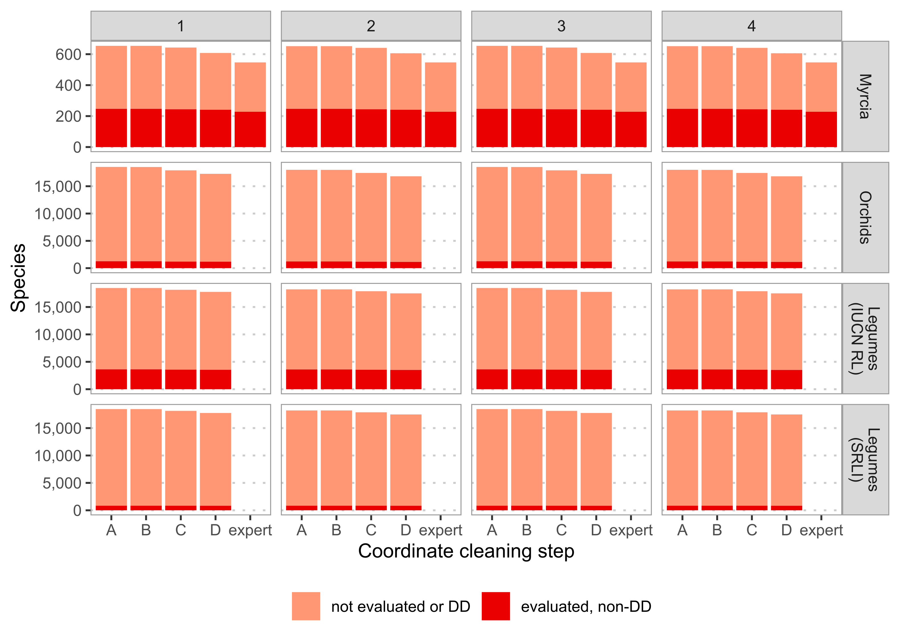
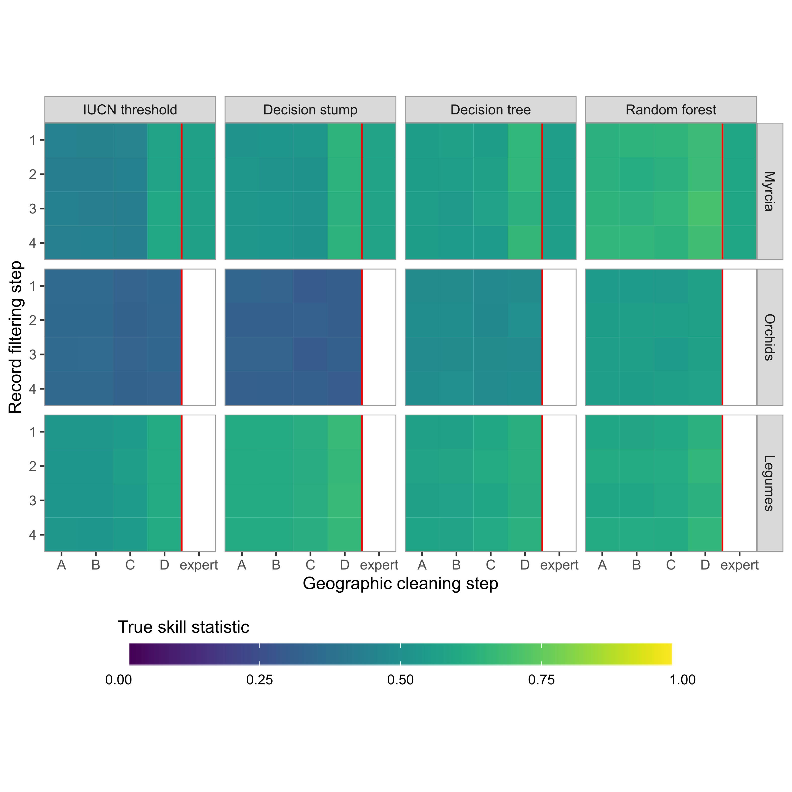
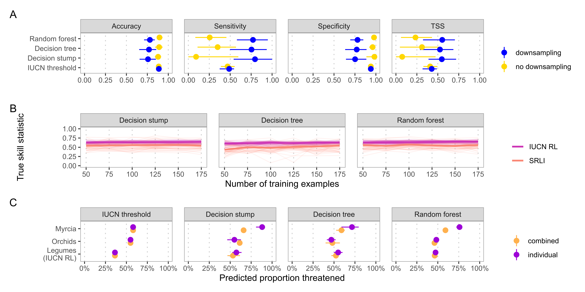
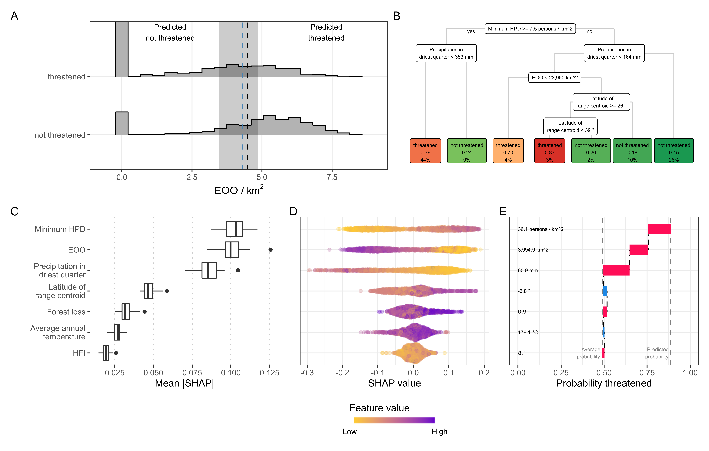

```{r setup, include=FALSE}
knitr::opts_chunk$set(echo=FALSE)
```

```{r libraries, include=FALSE}
library(here)
library(vroom)
library(tibble)
```

# Abstract

1. Assessing species' risk of extinction is a vital first step in setting conservation priorities. However, assessment endeavours like the IUCN Red List of Threatened Species still have significant gaps in their coverage of some taxonomic groups. Automated assessment (AA) methods are gaining popularity to rapidly fill these gaps, taking advantage of improvements in computing and digitally available information.  However, implicit choices made when developing and reporting automated assessment methods could prevent their successful adoption or, even worse, their predictions could lead to poor allocation of conservation resources.

2. We systematically explored how the choice of data cleaning, taxonomic group, training sample, and automation method affected predicted threat status. We used occurrence records from GBIF to generate assessments for three distinct taxonomic groups using four different automated assessment methods. We measured each method's performance and coverage after applying increasingly stringent cleaning to the input occurrence data. We used these results to build evidence-based guidelines for developing and reporting automated assessments.

3. Automatically cleaned data from GBIF resulted in comparable performance to occurrence records cleaned manually by an expert. However, all types of data cleaning removed species and limited the coverage of automated assessments. This limitation was more severe for some groups of species than others. Overall, machine learning-based methods performed well on all taxonomic groups, even with minimal data cleaning.

4. We recommend using a machine learning-based method on minimally cleaned data to get the best compromise between performance and species coverage. However, our results demonstrate that the optimal data cleaning, training sample, and automation method depends on the focal group of species. Therefore, we recommend evaluating new AA methods across multiple groups and providing additional context with extinction risk predictions for users to make informed decisions.

# Keywords
IUCN Red List, machine learning, automation, biodiversity conservation

# Introduction

Identifying and documenting species at risk of extinction is critical in setting priorities and acting to protect biodiversity. The IUCN Red List of Threatened Species (IUCN Red List), the most widely accepted framework for assessing species’ global extinction risk, covers the entirety of some groups (e.g. birds) but only ~15%  of vascular plant species [@IUCN2021a]. Such gaps in extinction risk knowledge may lead to inefficient or inappropriate conservation resource allocation. Automated assessment (AA) methods can help close this assessment gap [@NicLughadha2020]. However, systematic exploration of methods is necessary for their effective application.

Growing recognition of the imperative to accelerate extinction risk assessments [@AlbaniRocchetti2020;@Bachman2019], advances in digitisation of natural history collections [@Paton2020], and widening availability of biodiversity data have stimulated development of AA methods. Early examples of method development focused on relatively small groups: Krupnick et al. [-@Krupnick2009] calibrated a rule-based method on 1,192 Hawaiian plants, Bland et al. [-@Bland2015] compared how different machine learning algorithms predicted the conservation status of 637 terrestrial mammals, and Darrah et al. [-@Darrah2017] explored the use of coarse-scale distribution data to predict conservation status for 6,439 bulbous monocots.

Subsequent studies applied automated methods to larger datasets, including a continental-scale preliminary assessment of 22,036 species of tropical African plants [@Stevart2019], an automated assessment of 13,190 orchid species [@Zizka2020], and identification of global conservation priorities using automated assessments for over 150,000 land plants [@Pelletier2018]. These studies recognise limitations in their approaches while, nonetheless, suggesting their new method can inform conservation prioritisation in specific situations. For example, Stevart et al. [-@Stevart2019] propose areas of High Conservation Value, and Pelletier et al. [-@Pelletier2018] propose global “geographic regions with the highest need of conservation efforts”. However, complete information required for potential users to evaluate these methods’ performance, and the resulting priorities, is not consistently reported [@Walker2020].

Given these high-stakes applications of AA methods, thorough consideration of their benefits and limitations seems prudent. Potential misinterpretation [@Wearn2019] of AA methods could be avoided if developers fully explored and reported the implicit choices made when producing an AA method. Similarly, conservation biologists wishing to adopt automated methods need clear guidelines about which methods to choose and how best to use them.

Specifically, four questions central to adoption and successful use of AA methods are:

1. **How clean must occurrence data be?** Issue with the quality of occurrence record data from online databases are well known [@Meyer2016;@Paton2020;@Panter2020]. Species occurrence records are therefore thoroughly checked and geo-referenced during Red List assessments, requiring significant time investment. AA methods typically use automated cleaning on digitally available occurrence records to make this step more time-efficient, but overly-strict cleaning could limit benefits of automated assessments. 

2. **How does the study group affect data cleaning and AA performance?**  Research interests and data availability often determine the group of species used to develop or apply an AA method. Studies reporting AA method performance typically apply them to taxonomically or geographically-defined groups [@Bland2015;@Stevart2019;@Zizka2020]. However, different factors influence the number and quality of occurrence records available for particular species. For example, temperate species tend to have more occurrence records available than tropical species. Therefore, AA method choice may interact with occurrence record cleaning to make different methods more appropriate for particular species groups.   

3. **Which sample of assessments is most effective for training and evaluating AA methods?** A sample of species with published IUCN Red List assessments is needed to measure AA method performance and train machine-learning-based methods. To maximise sample size, studies usually use all assessed species in the group of interest. However, given the historically non-systematic choice of species for assessment [@NicLughadha2020], assessed species may not represent diversity within a group. Furthermore, numbers of species assessed in each Red List category are imbalanced, potentially causing problems for machine-learning models. These issues raise questions about whether a representative sample of assessed species is preferable and if strategies such as downsampling should be used to correct imbalances in training data.

4. **When should one AA method be used over another?** Proposed AA methods fall into two groups: methods that use pre-determined thresholds and heuristics to mimic the IUCN Red List assessment process and methods that use machine learning to determine thresholds from previously assessed species data. Both groups can deliver predictions with a high correspondence to manual IUCN Red List assessments, but each offers distinct advantages. Pre-determined rules can make their decisions easier to interpret and troubleshoot than some popular machine learning techniques, such as random forests or neural networks. Alternatively, machine learning methods may be more robust to unclean data. The desired balance between predictive accuracy, ease of use, and interpretability may change depending on data available, the group of species being assessed, and the intended users.

In this report, we systematically investigate the effect of data cleaning, study and sample group choice, and AA method by applying four different automated methods to generate preliminary assessments for three groups of flowering plants with distinct occurrence record profiles (e.g. observations vs vouchered data, collected by generalists or specialists). We compare performance of these methods on digitally available occurrence data following different levels of automated cleaning and a database of manually cleaned occurrences. We also examine how choices concerning training data and downsampling affect the performance of machine learning methods. In doing so, we develop evidence-based recommendations for using AA methods and highlight important unanswered questions. While we focus on applying AA methods to plants, these guidelines are applicable to other under-assessed groups, such as arthropods.

# Methods

## Data compilation

We chose three distinct species groups to evaluate the effects and performance of choices in the automated assessment process. We selected these groups based on their geographic and taxonomic differences and their different collection histories. These groups were:

1. The widespread genus *Myrcia* (~750 spp; family Myrtaceae). *Myrcia* species are notoriously difficult to identify, so provide an example where records held by digital resources, like GBIF, may contain significant taxonomic errors. After decades/centuries of taxonomic impediment, molecular analysis and collaborative systematic study are enabling a monographic approach. Access to a monographer's database of *Myrcia* specimens allow us to compare manual and automatic data collection and cleaning.

2. All species in the family Orchidaceae (orchids). This large family (~30,000 spp) has a small proportion of species assessed, presenting a real-world example where rapid preliminary assessments could help focus resources on potentially threatened species. Furthermore, Orchidaceae is the focus of a previous study [@Zizka2019], allowing direct comparison of results.

3. All species in the family Leguminosae (Fabaceae, legumes). Like orchids, the legumes are a large family (~22,000 spp), comprising a significant amount of worldwide angiosperm diversity. Unlike Myrtaceae, legumes are relatively well understood taxonomically and well-documented (e.g. Lewis et al. 2005). Legumes are a focal group of the Sampled Red List Index (SRLI), allowing us to compare the effect of training and evaluating AA methods on the sample of legumes used for the SRLI and all assessed legumes on the Red List.

We obtained checklists of accepted species for all three groups from the World Checklist of Vascular Plants [@WCVP2021]. The taxonomy of *Myrcia* occasionally differs due to ongoing revisionary study (e.g., Lima-Santos et al., unpublished data).

### Species assessments

We downloaded published assessments for the three species groups from the IUCN Red List of Threatened Species ([@IUCN2021]; hereafter Red List) and supplemented the Myrcia data set with 23 as yet unpublished assessments carried out by Kew’s Plant Assessment Unit. We matched assessment names to WCVP taxonomy using the Kew Names Matching Service (KNMS). We chose KNMS over other taxon name resolution tools because it provides a simple interface for directly matching names to WCVP. We manually resolved unmatched names and updated accepted names of assessments matched to homotypic synonyms. We removed all assessments matched to non-homotypic synonyms, as the assessment might not apply to the new species concept. We also removed unmatchable assessments or those that matched species outside our accepted species lists.

### Occurrence records

We downloaded occurrence records from GBIF for the entire families to which our groups belong. As with Red List assessments, we matched taxon names of these occurrence records to the WCVP taxonomy. However, the number of unmatched names made manual resolution infeasible, so we used a more automated matching process (see Supplementary Materials).

For *Myrcia*, we retrieved occurrence records from a monographer's database prepared for *Myrcia s.l.* (E. Lucas, unpublished data). All databased specimens were fully or partially verified by an expert. Specimen georeferences were checked or added as part of the monographic process. We passed the occurrence records from this database through the same name matching process as the GBIF occurrence records to catch any that did not match the accepted name in WCVP.

## Occurrence record cleaning

To address our study's first question, we passed each set of occurrences through automated cleaning steps. These steps took two approaches: filtering records lacking voucher specimens or representing duplicates and removing records based on their coordinates.

```{r cleaning-steps}
cleaning_steps <-
  tribble(~`Step`, ~`Description`,
          "1", "No filtering of occurrence records",
          "2", "Keep only records based on preserved specimens",
          "3", "Keep one of every record at exactly the same coordinates for each species",
          "4", "Apply both filter step 2 and 3",
          "A", "No geography-based cleaning",
          "B", "Remove occurrence records with coordinates at (0, 0)",
          "C", "Remove occurrence records in the sea, at equal longitude and latitude, at country centroids, and at identified institutions",
          "D", "Remove occurrence records outside each species native range as listed in POWO")

cleaning_steps %>%
  knitr::kable(
    caption="A description of each filtering and coordinate cleaning step. Filtering steps were applied separately, while coordinate cleaning steps were applied consecutively (i.e. step C was applied to a dataset already cleaned by step B)."
  )
```

We applied filters to test whether removing occurrences based on anything other than preserved specimens or removing duplicated occurrences affected extinction risk prediction. The combination of these filters led to four different filter levels (Table \@ref(tab:cleaning-steps)).

We chose our coordinate cleaning steps based on the approaches of other automated assessment (AA) methods studies (e.g. [@Bachman2020]). We applied each step sequentially to give increasing levels of coordinate cleaning (Table \@ref(tab:cleaning-steps)).

We passed all occurrence data sets, except the *Myrcia* monographic database occurrences, through all permutations of these filtering and cleaning steps. These steps produced 16 occurrence records sets for each species group, plus an additional set of occurrences from the *Myrcia* monographic database.

## Predicting threat status

We generated extinction risk predictions for species groups based on sets of predictors calculated from each of the 16 cleaned occurrence data sets, as well as the monographic data set for *Myrcia*. We chose to calculate these predictors (Table \@ref(tab:predictor-table)) for all species with at least one occurrence record in the cleaned occurrence data set. See Supplementary Methods for a full description of predictor preparation.

We made predictions with four different AA to explore trade-offs between predictive performance, ease of use, and interpretability:

1. A threshold-based method, using the IUCN threshold for the extent of occurrence (EOO) of threatened species, i.e. <20,000 km$^2$ [@IUCN2012]. The single, fixed threshold made this easy to use and interpret.

2. A decision tree with a single split (a decision stump) on species' EOO. This simple machine learning model requires slightly more expertise than the IUCN threshold but remains readily interpretable.

3. A decision tree using predictors including EOO and measures of species' environment and exposure to threats (Table \@ref(tab:predictor-table)). More splits and predictors than the decision stump make this method harder to use and understand. However, we limited the maximum number of splits to 5 to ensure ready interpretation.

4. A random forest model using the same set of predictors as the decision tree. This method is hardest to interpret and use but has shown good performance in previous studies predicting extinction risk [@Bland2015;@Darrah2017;@Lughadha2019;@Pelletier2018].

We chose to predict if a species is threatened, to reduce imbalance between classes. Following the IUCN definition, we grouped the Critically Endangered, Endangered, and Vulnerable categories into our threatened class [@IUCN2012] and grouped the Near Threatened and Least Concern categories into our non-threatened class. We treated Data Deficient species as unassessed, generating predictions for them from our AA methods. We excluded Extinct and Extinct in the Wild species from our study.

```{r predictor-table}
predictor_table <-
  tribble(
    ~Predictor, ~Calculation,
    "Extent of occurrence (EOO)", "Minimum convex polygon",
    "Latitude of range centroid", "Centroid of occurrence records",
    "Human population density (HPD)", "Minimum value",
    "Human footprint index (HFI)", "Mean value",
    "Forest loss", "Mean of proportion of pixels with forest loss from a 5km radius buffer around occurrence records",
    "Elevation", "Maximum value",
    "Precipitation in the driest quarter", "Mean value",
    "Average annual temperature", "Mean value"
  )

predictor_table %>%
  knitr::kable(caption="Predictors used in AA methods and their calculation. Unless otherwise stated, all values were extracted from the location of individual occurrence records. See Table S1 for data sources.")
```

### Method evaluation

As the number of species with assessments for each taxonomic group was limited, we used 5-fold cross-validation repeated 10 times to train and evaluate our decision stump, decision tree, and random forest models. We used 100 bootstrap resamples of the data with assessments to evaluate our threshold-based method. We used the true skill statistic (TSS) as a balanced measure of performance to evaluate all methods, as well as accuracy, sensitivity, and specificity (see Supplementary Methods for definitions). We also calculated the coverage of each cleaned occurrence dataset as the proportion of each species group for which a prediction could be made, i.e. the proportion of species with at least one occurrence record.

## Training and evaluation sample choice

We examined three aspects of the training and evaluation sample: representativeness, size, and balance of threatened to non-threatened species. We addressed representativeness by comparing our AA methods’ performance on all assessed legumes to their performance on legumes assessed for the SRLI, a sample designed to be representative of taxonomic and geographic legume diversity.

We evaluated the effect of sample size when training our three machine-learning-based AA methods by splitting our datasets into 5 cross-validation folds, training our models on subsamples of the training data, and measuring subsequent performance on the validation sets. We increased subsample size from 50 to 175 species in increments of 25. We also evaluated each model's performance with a training set combining all three datasets.

We assessed the effect of sample balance on our three machine-learning-based AA methods by downsampling training sets to balance the number of threatened and non-threatened species, as Pelletier et al. [-@Pelletier2018] did for their random forest models.

## Method interpretation

We compared the interpretability of our machine-learning-based methods by inspecting the classification boundary of our decision stump model and a flow chart of splits from our decision tree model. We calculated SHapely Additive exPlanations (SHAPs) to interpret our random forest model. These values estimate each predictor's contribution to a prediction [@Lundberg2017] and can be aggregated to provide the importance and partial dependence of each predictor, as well as individual explanations. We limited this comparison to models trained on the orchid dataset with minimally cleaned data (filtering step 1 and coordinate cleaning step A) because orchids have proven more challenging to predict accurately than other plant groups [@NicLughadha2019].

For additional context, following Zizka et al. [-@Zizka2020], we fit logistic regression models to predictions for assessed species from all AA methods, of the form:

\begin{equation}
log(\frac{\hat{p}_i}{1 - \hat{p_i}}) = \alpha + \beta log_{10}(N)
\end{equation}

where $\hat{p_i}$ is the estimated probability a prediction is correct and $N$ is the number of occurrence records for a species.

## Software

We performed our study using the R statistical computing language [@RCoreTeam2020]. Packages are detailed in the Supplementary Methods.

# Results

## How clean must occurrence data be?

All methods performed well across every filtering and cleaning step, with TSS remaining above 0.25. Variation in TSS across CV folds suggests no clear change in performance with occurrence data cleaning (Fig. S1).

Performance improvement was largest for the IUCN threshold method from coordinate cleaning step A to D for all datasets except Orchids (Fig. \@ref(fig:performance-grid)). Mean TSS increased from 0.43 to 0.60 for *Myrcia*, 0.41 to 0.58 for SRLI legumes, and 0.53 to 0.61 for all legumes. Filtering steps 2, 3, and 4 had a negligible impact on performance.

Performance of all methods was slightly poorer on the *Myrcia* monographic database than GBIF data with full coordinate cleaning. The random forest model's performance was worse on data from the monographic database (TSS = 0.59) than on minimally cleaned GBIF data (0.66).

## How does the study group affect data cleaning and AA method performance?

After name-matching the GBIF occurrence records with coordinates (step 1A), the *Myrcia* dataset was the smallest at 48,262 records covering 654 accepted species. The orchid dataset was the next largest, with 4,282,221 records for 18,012 accepted species, followed by the legumes with 14,573,494 records covering 18,467 accepted species. 

### Data cleaning

Almost all *Myrcia* records were from preserved specimens (93.9%), while corresponding proportions were much smaller for the orchid (14.3%) and legume (15.2%) datasets. Therefore, filtering step 2 (keeping preserved specimens only) removed most orchid and legume occurrence records but very few *Myrcia* records. Filtering step 3 (removing records at duplicated coordinates) profoundly affected each dataset's number of occurrences, reducing the *Myrcia* dataset to 31,298 unique occurrences (64.9%), orchids to 1,912,129 (44.7%), and legumes to 8,415,070 (57.7%).

The coordinate cleaning steps removed fewer records than the filtering steps. Coordinate cleaning step C removed most records from the orchid dataset (7.2%), while step D removed most records from the *Myrcia* (7.6%) and legume datasets (16.4%). Applying all filtering and coordinate cleaning steps removed 42.9% of *Myrcia* occurrences, 91.1% of legume occurrences, and 91.2% of orchid occurrences. The monographic database comprised 10,823 *Myrcia* occurrences, less than half number in the automatically cleaned dataset.

###  Species coverage

Filtering (steps 2 to 4) and cleaning (steps B to D) reduced the number of species available to train and evaluate AA methods, and limited the total proportion of species covered by automated predictions (Fig. \@ref(fig:species-coverage)). Before matching to GBIF occurrence records, the *Myrcia* dataset comprised 769 species, with non-Data Deficient (DD) Red List assessments for 254 (33.0%). The orchid dataset comprised 30,479 species, 1,457 with non-DD assessments (4.8%), and the legume dataset comprised 22,123 species, 3,740 with assessments (16.9%), 844 of which assessd for the SRLI. AA method predictions would increase the proportion of species with an evidence-based assessment of extinction risk to, at most, 85.0% of *Myrcia* species, 83.5% of legumes, and 60.8% of orchids.

```{r species-coverage, out.width="100%", fig.cap="Number of species in each dataset with at least one occurrence record after applying each filtering and cleaning step. Dark red bars show the number of species with non-Data Deficient IUCN Red List assessments, used to train and evaluate AA methods."}

```

All filtering and cleaning steps removed few species from the *Myrcia* dataset, except step D, which removed 35 species. Step 2 removed many species from the legumes (246) and orchids (529) because most of their records were not based on preserved specimens. Steps C and D both removed the most species — step C removed 325 legume and 612 orchid species, while step D removed a further 386 legume and 635 orchid species.  

Applying all filtering and cleaning steps left 606 *Myrcia* species, 17,491 legumes, and 16,825 orchids to use in the AA methods. Therefore, filtering and cleaning limited prediction coverage to 78.8% of *Myrcia* species, 79.1% of legume species, and 55.2% of orchid species. Removing these species also reduced the number of species available to train and evaluate the AA methods to 241 *Myrcia* species, 3,581 legumes, and 1,145 orchids. The monographic database covered 547 *Myrcia* species (71.1% of accepted *Myrcia* species), 228 of which were available to train and evaluate AA methods.

###  Performance

The IUCN threshold and decision stump methods performed worst on the orchid dataset, even with full coordinate cleaning (0.32 and 0.29, respectively; Fig. \@ref(fig:performance-grid)). In contrast, the TSS of both methods improved after full coordinate cleaning for the *Myrcia* dataset (IUCN threshold: 0.43 to 0.60; decision stump: 0.53 to 0.64). A smaller improvement was achieved on the legume dataset (IUCN threshold: 0.53 to 0.61; decision stump: 0.64 to 0.68).

```{r performance-grid, out.width="100%", fig.cap="Performance of automated assessment methods on datasets of *Myrcia*, orchid, and legume species after automated occurrence record filtering and coordinate cleaning. Results for *Myrcia* include a dataset of expert cleaned occurrences. For the legume datasets, methods were trained and evaluated on all legume assessments on the IUCN Red List, and assessments carried out on a random sample of legume diversity as part of the Sampled Red List Index (SRLI)."}

```

The TSS was higher for the orchid dataset with the decision tree and random forest models, even with minimal coordinate cleaning (decision tree: 0.49; random forest: 0.56). However, the TSS of corresponding models trained on the *Myrcia* (decision tree: 0.55; random forest: 0.69) and legume (decision tree: 0.65; random forest: 0.68) datasets was still higher.

## Which sample of assessments is most effective for training and evaluating AA methods?

The SRLI legume assessments had a low proportion of threatened assessments (11.8%). Although all three machine-learning-based methods' accuracy was above 85% on this training set (Fig. \@ref(fig:sample-choice)A), models trained on the SRLI assessments suffered from very low sensitivity (decision stump: 0.09; decision tree: 0.35; random forest: 0.26). Downsampling improved sensitivity for all machine-learning-based models trained on SRLI assessments (decision stump: 0.80; decision tree: 0.75; random forest: 0.77), thereby increasing the TSS but slightly reducing accuracy (Fig. \@ref(fig:sample-choice)A). Downsampling caused little to no improvement when trained on all legumes, or the  *Myrcia* and orchid training sets (Fig. S3), where the imbalance between classes was lower (20.5%, 40.9%, and 52.6% threatened, respectively).

```{r sample-choice, out.width="100%", fig.cap="Exploration of AA method training and evaluation sample choice, comprising (A) the effect of downsampling on different performance metrics when AA methods were trained and evaluated on a representative sample of legume species used for the Sampled Red List Index (SRLI), (B) change in machine-learning-based AA method performance as they are trained on successively larger subsets of all legumes assessed on the IUCN Red List and those used for the SRLI, and (C) difference in proportion of unassessed species predicted threatened when AA methods are trained and evaluated on individual datasets and on one combined dataset. Bars on (A) and (C) represent the 95% confidence interval of the cross-validated estimates."}

```

Even with downsampling, all AA methods performed worse when trained on the SRLI legume assessments than all assessed legumes (Fig. \@ref(fig:sample-choice)A, Fig. S3). Training the three machine-learning-based methods on successively larger subsets of the two groups of legume assessments (Fig. \@ref(fig:sample-choice)B) indicated that this difference in TSS persisted regardless of training set size.

Training machine-learning-based models on all groups combined caused little or no improvement in our evaluation metrics (Fig. S4), but did result in lower sensitivity for *Myrcia* species. This difference in sensitivity corresponded to a lower predicted level of threat in unassessed *Myrcia* species when datasets were pooled (Fig. \@ref(fig:sample-choice)C).

## When should one AA method be used over another?

All AA methods investigated achieved high predictive accuracy, regardless of the amount of cleaning applied to occurrence records (Fig. S5A). The highest accuracies were achieved on the *Myrcia* and legume datasets (78% - 89%), while accuracy on the orchid dataset was lower (61% - 79%). However, methods were often better at correctly predicting non-threatened species than threatened ones. The IUCN threshold method had the most marked imbalance across all datasets (Fig. S5B-C). Of the three AA methods investigated, our random forest model consistently had the highest TSS (Fig. \@ref(fig:performance-grid)).

Logistic regressions fit to predictions for assessed species demonstrated that the accuracy of all models had some dependence on the number of occurrence records (Fig. S6; Table S2). This dependence was highest for IUCN threshold method applied to Legumes ($\beta = 3.41$, 95% CI=[3.04, 3.97])

We explored different methods to interpret our machine learning models' behaviour using the orchid dataset. We summarised the decision stump model by extracting the learned EOO threshold. The average threshold across all CV folds was 30,848 km$^2$, higher than the IUCN threshold of 20,000 km$^2$, but the 95% confidence interval was wide and ranged from 2,833 km$^2$ to 73,290 km$^2$ (Fig. \@ref(fig:explanations)A).

```{r explanations, out.width="100%", fig.cap="Methods for interpreting machine-learning-based automated assessment methods. The decision stump model can be readily interpreted by (A) inspecting the classification boundary, with a 95% confidence interval estimated by cross-validation. The decision tree provides (B) a simple flow-chart displaying splits in the tree and final decisions as leaves, labelled with the classification probability and percent of species cover by each leaf. We used SHapely Additive exPlanations (SHAPs) to interpret the behaviour of our random forest model. These values estimate the contribution of each predictor in the model to individual predictions. They can be aggregated to give (C) the overall importance of each predictor and (D) an indication of how the contribution of each predictor varies with that predictors value. Explanations of individual predictions can be displayed as (E) force plots to provide contextual information for a single prediction. All interpretations were made for models trained on the orchid dataset with minimal automated cleaning (step 1A). The individual explanation is for the species *Tridactyle phaeocephala*."}

```

We interpreted our decision tree model by inspecting the tree learned from one of the CV folds (Fig. \@ref(fig:explanations)B). This revealed that most threatened species (44% of all species in the training set) were classified based on a minimum human population density above 7.5 persons/km$^2$ and precipitation in the driest quarter below 35.3 mm. However, it also showed that this step only classified 79% of these species correctly.

As a global explanation, we calculated predictor importance for our orchid random forest model as mean absolute SHAP for each predictor across all test predictions (Fig. \@ref(fig:explanations)C). The three most important predictors for the orchid dataset were minimum HPD (mean absolute SHAP = 0.103), EOO (mean absolute SHAP = 0.101), and precipitation in the driest quarter (mean absolute SHAP = 0.086). To check for consistency, we also calculated the permutation predictor importance for all datasets (Fig. S7). The ranking of predictors for the orchid dataset was the same as the ranking from SHAP values; however, permutation importance indicated EOO as by far the most important predictor for the legume and *Myrcia* datasets.

We used the contribution of each predictor to each test prediction to plot a SHAP-based partial dependence plot (Fig. \@ref(fig:explanations)D). This plot revealed our orchid model was behaving as expected. More populated areas (higher minimum HPD) increased predicted probability of threat. In contrast, more precipitation in the driest quarter or larger ranges (higher EOO) reduced predicted probability of threat.

We examined the contribution of each predictor to a single prediction, for *Tridactyle phaeocephala*, as an example of an individual explanation. The SHAP force plot (Fig. \@ref(fig:explanations)E) indicates that low precipitation in the driest quarter (60.9 mm), small EOO (3,995 km$^2$), and relatively high human population density (36.1 persons / km$^2$) all pushed the probability of being threatened up to 0.89 from the average predicted probability of 0.49. However, this species is assessed as Least Concern on the IUCN Red List because, despite having a low EOO, there are no identified threats. The discrepancy between this species' predicted and assessed extinction risk suggests that more detailed threat predictors or information about protected areas should be incorporated into our model.

# Discussion

High-stakes applications of AA methods in conservation make it essential that developers thoroughly explore implementation choices and that users can make informed decisions about best methods for their problem. Our study systematically investigated key AA method choices to build upon previous work and provide evidence-based guidelines for their use.

## How clean must occurrence data be?

Given the well-documented issues with digitally available occurrence records [@Meyer2016;@Maldonado2015;@Zizka2019], it may seem reasonable to assume that AA methods will always perform better with carefully cleaned and georeferenced data. For example, Panter et al. [-@Panter2020] obtained more reliable preliminary assessments for species in Bolivia after manually cleaning GBIF data.

Our results show that, despite these issues, AA methods using automatically cleaned data from GBIF give comparable or better performance than with hand-cleaned and georeferenced data. While we based our comparison on a relatively small set of around 200 species in the genus *Myrcia*, the high accuracy of other AA methods reported in the literature supports our findings [@Lughadha2019;@Zizka2020;@Stevart2019].

Data cleaning was necessary to achieve good performance from the IUCN threshold method with  *Myrcia* and legume species. However, we found that data cleaning made little difference to the performance of the IUCN threshold method with orchid species. Similarly, Zizka et al. [-@Zizka2020] found that accuracy of another threshold-based AA method (ConR) on orchids did not improve with data cleaning. Therefore, we expect the optimal level of cleaning for threshold-based AA methods to depend on the study group.

Machine learning methods investigated were less sensitive to data cleanliness, suggesting they can make good-quality automated assessments with minimal cleaning. Ability to use minimally cleaned data is important because we found a trade-off between using a highly cleaned set of occurrences records and generating predictions for as many species as possible. While all methods performed best with full automated cleaning, species removed by cleaning limited coverage of our predictions to 80.7% of *Myrcia*, 77.4% of legume, and 54.6% of orchid species. Other attempts at large-scale predictions of plant extinction risk have been similarly limited [@Zizka2020;@Pelletier2018].

However, whatever the chosen level of cleaning, a large proportion of plant species have few or no digitally available occurrence records. These species are mostly rare, range-restricted, and therefore likely to be threatened. This problem was most acute for orchds, where we could make predictions for at most 60.2% of species.

One solution, explored by Darrah et al. [-@Darrah2017], uses coarse-scale distribution data instead of occurrence records. While coarse-scale distribution data is available for almost all species [@POWO2019], many predictors used in AA methods are heterogeneous across larger areas. This approach, therefore, needs testing more broadly. Nonetheless, a means of handling species lacking digitally available occurrence records is urgently needed. Otherwise, we risk ignoring many of the most threatened species when using AA methods, thereby underestimating the number or proportion of threatened species globally or in comparative analyses to inform conservation prioritisation.

## How does chosen study group affect data cleaning and AA method performance?

Differences in performance between AA methods and automated cleaning steps in our study illustrate the importance of carefully choosing the protocol to fit a particular group of species. Furthermore, the full impact of a methodological choice, such as how occurrence records are cleaned, may not be apparent when assessed on a single taxonomic or geographic group, even one as large as the whole orchid family. 

Our findings are consistent with those of Zizka et al. [-@Zizka2020], who compared the effect of a wide range of automated cleaning steps on occurrence records across distinct taxonomic groups. They found that although automated cleaning removed 45% of all occurrence records, the loss from any individual dataset varied between 29.7% and 90.3%. Given the interaction between these cleaning differences and method performance, we recommend that those developing/testing AA methods choose multiple groups with distinct characteristics, to identify the optimal protocol for each group and improve trust in findings.

## Which sample of assessments is most effective for training and evaluating AA methods?

Using a machine-learning-based AA method raises the additional question of which sample of species is best to use for training. While the tendency might be to use as many species as possible, well-known gaps and biases in species selected for assessment may lead to poor predictive performance on unassessed species. 

Our results suggest there is little benefit to using a sample of species designed to be representative of the diversity of the group of interest. Models trained on all available legume assessments outperformed the same model trained only on species assessed as part of the SRLI. This discrepancy remained when we trained models on equal-sized subsamples of the two sets of assessments, suggesting differences in performance were more likely due to the large imbalance between threatened and non-threatened species in the SRLI than the datasets' different sizes. 

Pelletier et al. [-@Pelletier2018] downsampled training sets for their random forest models to give equal numbers of species in each class. We found that downsampling improved the overall performance of all machine-learning-based models trained on the SRLI assessments at a small cost to predictive accuracy. However, downsampling made little difference to the performance on all other datasets, where the imbalance was lower.

Similarly, we saw no benefit to performance when we combined the *Myrcia*, legume, and orchid assessments into a single training set. We did, however, see a small drop in the ability of all methods to identify threatened *Myrcia* species and a corresponding decrease in the proportion of unassessed *Myrcia* species predicted as threatened. This decrease may cause issues for applications that use sub-groups of these predictions, such as setting assessment priorities for particular taxonomic groups.

## When should one AA method be used over another?

We found the random forest model was the best performing AA method for all species groups at every level of occurrence cleaning. However, all methods performed well and, with full automated cleaning of occurrence records, even the simplest IUCN threshold method achieved comparable performance.

Despite their high predictive accuracy, a random forest model may not always be the best choice. Other considerations include the expertise and time needed and the fact that the model's complexity makes its behaviour difficult to understand. This opacity makes diagnosing problems with the method difficult, so it is hard to know how much to trust individual predictions [@Wearn2019].

Recent developments have made it easier to interpret black-box algorithms like random forests or neural networks (Molnar 2019).  We used SHapely Additive exPlanations (SHAP)[@Lundberg2017] to gain insight into our random forest orchid model by identifying the most important predictors and how the predicted probability of being threatened depended on each predictor. Furthermore, we were able to diagnose a possible deficiency in our choice of predictors by inspecting an explanation for an individual incorrect prediction.

However, SHAPs require additional computation and expertise that isn't necessary for understanding simpler methods like a decision tree model or the IUCN threshold. Nevertheless, given the potentially severe consequences of an incorrect prediction, we consider it essential to present additional context for predictions from all AA methods. While the exact context needs to be tailored to the intended application and user [@Suresh2021], authors should include calculated metrics or predictors and any easily obtained fixed or learned thresholds.

Estimates of uncertainty for the predicted probabilities of being threatened would also be valuable. Methods for estimating uncertainty for machine learning models include the infinitesimal jackknife [@Wager2014] for random forest predictions and estimating uncertainty directly through the modelling algorithm, such as Bayesian Additive Regression Trees [@Chipman2012] or Bayesian Neural Networks [@ValentinJospin2020]. However, these methods would not necessarily address the most significant source of uncertainty for AA methods: the underlying occurrence records.

Despite growing understanding of the relative importance across whole datasets of issues such as imprecise or incorrect coordinates or misidentifications in occurrence records [@Maldonado2015;@NicLughadha2019], the goal of quantifying resultant uncertainty for individual extinction risk predictions has yet to be attained [@Walker2020]. Such prediction-specific uncertainty estimates would be invaluable in the context of both threshold and machine-learning based AA methods.

# Conclusions

We have attempted to provide evidence-based answers that lower barriers to successful adoption of automated assessment methods. Based on our findings, our answers are:

1. **How clean must occurrence data be?** Cleaning level is dependent on the group of species examined, but good performance is possible using AA methods on occurrence records from digital resources with automated cleaning. We recommend using minimal cleaning in conjunction with a machine learning-based AA method for the best species coverage. However, if a threshold-based method is preferred, more stringent automated cleaning is necessary for best performance.

2. **How does the chosen study group affect data cleaning and AA method performance?** Performance of AA methods and necessary cleaning levels are dependent on the group of species examined. We, therefore, recommend evaluating AA methods on species groups with distinct characteristics. When making automated assessments, the focal species group is often pre-determined. In these cases, we recommend selecting an AA method and cleaning protocol that has worked well on a similar group or evaluating different protocols to find the best for the specific problem.

3. **Which sample of assessments is most effective for training and evaluating AA methods?** Our results suggest that it is best to use all assessed species, even when well-designed sub-sample is available. Machine-learning-based AA methods can make biased predictions when trained on an unbalanced sample of assessments, but downsampling is an effective strategy to counteract this. Finally, AA methods may perform well on a particular sample of assessments, but poorly on a sub-group within that sample. In such cases, it may be better to train individual AA methods on these sub-groups.

4. **When should one AA method be used over another?** Our random forest model consistently achieved the best results across all groups in our study, at all levels of data cleaning. However, more straightforward methods attained comparable performance in some settings. Ultimately, the most appropriate AA method will depend on intended applications and resources available.

As well as providing answers, our study raised some questions that present possible challenges in using AA methods:

* **How should we handle species with no available occurrence records?**  A large proportion of plant species have few or no digitally available occurrence records. This deficit limits applicability of AA methods and risks allowing the most threatened species to drop out of the assessment pipeline. AA methods must incorporate robust rules to handle these species.

* **How do we quantify uncertainty in a single species' prediction?** Presenting AA predictions alongside an uncertainty estimates would allow more effective decision making and open up new research avenues. While approaches exist for estimating uncertainty in machine learning predictions, there may be more value in quantifying uncertainty resulting from imprecisions in the underlying occurrence data.

By following this study's recommendations and tackling these challenges, conservation biologists can increase confidence in adopting AA methods to scale up assessments and close coverage gaps.

# Acknowledgments

All authors would like to acknowledge the hard work and dedication of Kew's Plant Assessment Unit team who, in collaboration with regional and taxon specialists at Kew and worldwide, assessed the extinction risk of many of the orchid and legume species and most of the Myrcia species included in our study. The Plant Assessment Unit was established through collaboration between IUCN and the Royal Botanic Gardens Kew within the project entitled ‘The IUCN Red List of Threatened Species and Toyota Motor Corporation’.

# Author contributions

BW, TL, SP, EL, and EN all conceived of the article, contributed to the study design, and contributed to the writing. BW carried out the analysis, prepared the figures, and prepared the first draft. EL provided data from the monographic database of *Myrcia* specimens.

# Data availability

The data and code used for this study will be archived in Zenodo upon submission.

# References