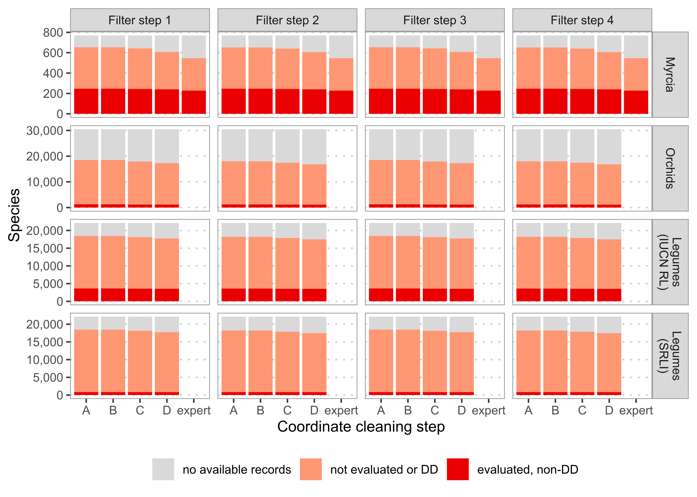

```{r setup, include=FALSE}
knitr::opts_chunk$set(echo=FALSE)
```

```{r libraries, include=FALSE}
library(here)
library(vroom)
library(tibble)
```

# Abstract

1. Assessing species’ extinction risk is vital to setting conservation priorities. However, assessment endeavours like the IUCN Red List of Threatened Species have significant gaps in coverage of some taxonomic groups. Automated assessment (AA) methods are gaining popularity to fill these gaps, leveraging improvements in computing and digitally-available information. Choices made in developing and reporting AA methods could hinder successful adoption or lead to poor allocation of conservation resources.

2. We explored how choice of data-cleaning, taxonomic group, training sample, and automation method affected performance of threat status predictions. We used occurrence records from GBIF to generate assessments for three taxonomic groups using four different AA methods. We measured each method’s performance and coverage after applying increasingly stringent cleaning to occurrence data.

3. Automatically cleaned data from GBIF yielded comparable performance to occurrence records cleaned manually by experts. However, all types of data-cleaning removed species and limited the coverage of automated assessments. Overall, machine learning-based methods performed well on all taxonomic groups, even with minimal data-cleaning.

4. Results suggest using a machine learning-based method on minimally cleaned data offers the best compromise between performance and species coverage. However, optimal data-cleaning, training sample, and automation methods depend on the study group, intended applications and expertise. We recommend evaluating new AA methods across multiple groups and providing additional context with extinction risk predictions so users can make informed decisions.

# Keywords
IUCN Red List, machine learning, automation, biodiversity conservation

# Introduction

Identifying and documenting species at risk of extinction is critical in setting priorities and acting to protect biodiversity. The IUCN Red List of Threatened Species (hereafter Red List), the most widely accepted framework for assessing species’ global extinction risk, covers all of some groups (e.g. birds) but only ~15% of vascular plant species [@IUCN2021a]. Gaps in extinction risk knowledge may lead to inefficient or inappropriate conservation resource allocation. Automated assessment (AA) methods can help close this assessment gap [@NicLughadha2020]. However, systematic exploration of methods is necessary for their effective application.

Growing recognition of the imperative to accelerate extinction risk assessments [@AlbaniRocchetti2020;@Bachman2019], advances in digitisation of natural history collections [@Paton2020], and widening availability of biodiversity data have stimulated development of AA methods. Early method development focused on relatively small groups: Krupnick et al. [-@Krupnick2009] calibrated a rule-based method on 1,192 Hawaiian plants, Bland et al. [-@Bland2015] compared different machine learning algorithms predicting the conservation status of 637 terrestrial mammals, and Darrah et al. [-@Darrah2017] explored coarse-scale distribution data for predicting conservation status of 6,439 bulbous monocots.

Subsequent studies applied automated methods to larger datasets, including a continental-scale preliminary assessment of 22,036 species of tropical African plants [@Stevart2019], an automated assessment of 13,910 orchid species [@Zizka2020], and generation of automated assessments for over 150,000 land plants [@Pelletier2018]. These studies recognise limitations in their approaches while, nonetheless, suggesting their new method can inform conservation prioritisation. For example, Stévart et al. [-@Stevart2019] propose areas of High Conservation Value, and Pelletier et al. [-@Pelletier2018] propose global “geographic regions with the highest need of conservation efforts.” However, complete information required for potential users to evaluate these methods’ performance, and the resulting priorities, is not consistently reported [@Walker2020].

Given these high-stakes applications of AA methods, thorough consideration of their benefits and limitations seems prudent. Potential misinterpretation [@Wearn2019] of AA methods can be avoided if developers fully explored and reported their choices when producing an AA method. Similarly, conservation biologists wishing to adopt automated methods need clear guidelines about method choice and appropriate use.

Specifically, five questions central to adoption and successful use of AA methods are:

1. **How clean must occurrence data be?** Quality issues affecting occurrence records in online databases are well known [@Meyer2016;@Paton2020;@Panter2020]. Species occurrences are, therefore, thoroughly checked during Red List assessments, especially the quality of georeferencing, requiring significant time investment. AA methods typically use automated cleaning on digitally-available occurrences to save time, but overly-strict cleaning could limit benefits of automated assessments.

2. **How does the study group affect data-cleaning and AA performance?** Research interests and data availability often determine species groups used to develop or apply AA methods. Studies reporting AA performance typically tackle taxonomically or geographically-defined groups [@Bland2015;@Stevart2019;@Zizka2020]. However, diverse factors influence the number and quality of occurrence records available for particular species, e.g. temperate species typically have more occurrence records available than tropical species. Therefore, AA method choice interacts with occurrence record cleaning, making different methods more appropriate for particular species groups.

3. **Which assessments are most effective for training and evaluating AA methods?** A sample of species with published Red List assessments is needed to measure AA method performance and train machine-learning-based methods. To maximise sample size, studies usually use all assessed species in the group of interest. However, given the historically non-systematic choice of species for assessment [@NicLughadha2020], assessed species may not represent diversity within a group. Furthermore, species assessed in each Red List category are imbalanced, potentially causing problems for machine-learning models. These issues raise questions: Would representative samples of assessed species be preferable? Should strategies such as downsampling be used to correct imbalances in training data?

4. **Do individual IUCN Criteria need to be considered?** Species are assigned a Red List category if they fulfil one or more quantitative criteria. Applying each criterion involves calculating different measures of species’ current, future, and change in distribution and population. In practice, most assessments are carried out under criterion B [@Lughadha2019], based on measures of species distribution calculated from occurrence records. Due to data availability, AA methods often incorporate predictors related to criterion B. However, there remains a question of how well AA methods can predict the status of species assessed under other criteria.

5. **When should one AA method be used over another?** Proposed AA methods comprise two groups: methods that use pre-determined thresholds and heuristics to mimic Red List assessment processes and methods that use machine learning to determine thresholds from previously assessed species data. Both groups can deliver predictions with high correspondence to manual Red List assessments, but each offers distinct advantages. Pre-determined rules make decisions easier to interpret and troubleshoot than machine learning techniques like random forests or neural networks. Alternatively, machine learning methods may be more robust to unclean data. The desired balance between predictive accuracy, ease of use, and interpretability may vary depending on available data, species group being assessed, and intended users.

Here, we systematically investigate the effects of data-cleaning, study and sample group choice, and AA method by applying four different automated methods to generate preliminary assessments for three groups of flowering plants with distinct occurrence record profiles. We compare performance of these methods on digitally-available occurrence data using different levels of automated cleaning and a database of manually-cleaned occurrences. We also examine how choices concerning training data and downsampling affect performance of machine learning methods. We develop evidence-based recommendations for using AA methods and highlight important unanswered questions. We focus on applying AA methods to plants, but these guidelines are applicable to other under-assessed groups, such as arthropods.

# Methods

## Data compilation

We chose three distinct species groups to evaluate the effects and performance of choices in automated assessment processes. We selected groups based on their geographic and taxonomic differences and their different collection histories. These groups were:
1. The neotropical genus *Myrcia* (~750 spp; family Myrtaceae). *Myrcia* species are notoriously difficult to identify, so records held by digital resources, like GBIF, may contain significant taxonomic errors. After decades/centuries of taxonomic impediment, molecular analysis and collaborative systematics are enabling a monographic approach. Access to a monographer’s database of *Myrcia* specimens allowed comparison of manual and automatic data collection and cleaning.

2. The family Orchidaceae (~30,000 spp, orchids). Only 5% of orchid species are published on the Red List, so rapid preliminary assessments could help focus resources on potentially threatened species. Furthermore, Orchidaceae is the focus of a previous study [@Zizka2019], allowing direct comparison of results.

3. The family Leguminosae (~22,000 spp, legumes). Another large family, but relatively well-understood taxonomically and well-documented (e.g. Lewis et al. 2005). Legumes are well-represented in the Sampled Red List Index (SRLI), allowing us to compare the effect of training and evaluating AA methods on a random sample and all assessed legumes on the Red List.

We obtained checklists of accepted species for all three groups from the World Checklist of Vascular Plants [@Govaerts2021]. *Myrcia* taxonomy occasionally differs due to ongoing revisionary study (e.g., Lima-Santos et al., unpublished data).

### Species assessments

We downloaded published assessments for the three species groups from the Red List [@IUCN2021] and supplemented the *Myrcia* data set with 23 unpublished assessments completed by Kew’s Plant Assessment Unit. We matched assessment names to WCVP, manually resolved unmatched names, and updated accepted names of assessments matched to homotypic synonyms. We removed all assessments matched to non-homotypic synonyms, unmatchable assessments, and those that matched species outside our accepted species lists.

### Occurrence records

We downloaded occurrence records from GBIF for the entire families to which our groups belong and matched taxon names of these occurrences to WCVP taxonomy (see Supplementary Materials).

For *Myrcia*, we retrieved occurrence records from a monographer’s database of *Myrcia* s.l. (E. Lucas, unpublished data). Databased specimens were verified by an expert. Specimen georeferences were checked or added during the monographic process. 

## Occurrence record cleaning

To address our first question, we passed each set of occurrences through automated cleaning steps using two approaches: filtering records lacking voucher specimens or representing duplicates, and removing records based on their coordinates.

```{r cleaning-steps}
cleaning_steps <-
  tribble(~`Step`, ~`Description`,
          "1", "No filtering of occurrence records",
          "2", "Keep only records based on preserved specimens",
          "3", "Keep one of every record at exactly the same coordinates for each species",
          "4", "Apply both filter step 2 and 3",
          "A", "No geography-based cleaning",
          "B", "Remove occurrence records with coordinates at (0, 0)",
          "C", "Remove occurrence records in the sea, at equal longitude and latitude, at country centroids, and at identified institutions",
          "D", "Remove occurrence records outside each species native range as listed in POWO")

cleaning_steps %>%
  knitr::kable(
    caption="A description of each filtering and coordinate cleaning step. Filtering steps were applied separately, while coordinate cleaning steps were applied consecutively (i.e. step C was applied to a dataset already cleaned by step B)."
  )
```

We applied filters to test whether removing occurrences not based on preserved specimens or removing duplicated occurrences affected extinction risk prediction. The combination of these filters led to four different filter levels (Table \@ref(tab:cleaning-steps)).

We chose our coordinate cleaning steps based on the approaches of other AA methods studies (e.g., [@Bachman2020]). We applied each step sequentially to give increasing levels of coordinate cleaning (Table \@ref(tab:cleaning-steps)).

We passed all occurrence data sets, except *Myrcia* monographic database occurrences, through all permutations of these filtering and cleaning steps, generating 16 occurrence records sets for each species group, plus an additional set of occurrences from the *Myrcia* monographic database.

## Predicting threat status

We generated extinction risk predictions for species groups based on sets of predictors calculated from each of 16 cleaned occurrence data sets, as well as the monographic data set for *Myrcia*. We calculated these predictors (Table S1) for all species represented in the cleaned occurrence data set. See Supplementary Methods for a full description of predictor preparation.

We made predictions with four different AA methods to explore trade-offs between predictive performance, ease of use, and interpretability (Table \@ref(tab:methods-info)).

```{r methods-info}
methods_info <-
  tribble(~`Method`, ~`Type`, ~`Description`, ~`Predictors`, ~`Interpretation`,
          "IUCN threshold", "Threshold-based", "The IUCN criterion B threshold for the extent of occurrence (EOO) of threatened species (EOO <20,000 km2).", "EOO", "-",
          "Decision stump", "Machine-learning-based", "A decision tree with a single split on species’ EOO. Requires more expertise than IUCN threshold but is still readily interpretable.", "EOO", "Inspecting the learned classification boundary.",
          "Decision tree", "Machine-learning-based", "A decision tree model limited to a maximum of 5 splits and using predictors including EOO and measures of species’ environment and exposure to threats. More splits and predictors than the decision stump make this method harder to use and understand.", "EOO, latitude of range centroid, human population density (HPD), human footprint index (HFI), forest loss, elevation, precipitation in the driest quarter, average annual temperature.", "Visualising the splits in the decision tree as a flow chart.",
          "Random forest", "Machine-learning-based", "A random forest model using the same set of predictors as the decision tree. This method is hardest to interpret and use but has shown good performance in previous studies predicting extinction risk [@Bland2015;@Darrah2017;@Lughadha2019;@Pelletier2018].",	"As above.", "Calculating SHapely Additive exPlanations (SHAP; [@Lundberg2017]) to give the individual contribution of each predictor to each prediction."
  )

methods_info %>%
  knitr::kable(
    caption="Description of the AA methods investigated; for a full description of predictors used and their data sources, see Table S1."
  )
```

We chose to predict if a species is threatened to reduce imbalance between classes. Following IUCN definitions, we grouped the Critically Endangered, Endangered, and Vulnerable categories as threatened [@IUCN2012], and grouped Near Threatened and Least Concern categories as non-threatened. We treated Data Deficient species as unassessed, generating predictions for them. We excluded Extinct and Extinct in the Wild species from our study.

### Method evaluation

As numbers of assessed species for each taxonomic group were limited, we used 5-fold cross-validation repeated 10 times to train and evaluate our decision stump, decision tree, and random forest models. We used 100 bootstrap resamples of the data with assessments to evaluate our threshold-based method. We used the true skill statistic (TSS) as a balanced measure of performance to evaluate all methods, as well as accuracy, sensitivity, and specificity (see Supplementary Methods for definitions). We also calculated the coverage of each cleaned occurrence dataset as the proportion of each species group for which a prediction could be made, i.e. the proportion of species with at least one occurrence record.

## Training and evaluation sample choice

We examined three aspects of the training and evaluation sample: representativeness, size, and balance of threatened to non-threatened species. We addressed representativeness by comparing our AA methods’ performance on all assessed legumes to performance on legumes assessed for SRLI, a sample designed to represent legume diversity, taxonomically and geographically. 

We evaluated sample size effects when training our three machine-learning-based AA methods by splitting our datasets into 5 cross-validation folds, training our models on subsamples of training data, and measuring subsequent performance on validation sets. We increased subsample size from 50 to 175 species in increments of 25. We also evaluated each model’s performance with a training set combining all three datasets.

We assessed the effect of sample balance on our three machine-learning-based AA methods by downsampling training sets to balance numbers of threatened and non-threatened species, as Pelletier et al. [-@Pelletier2018] did.

## Method interpretation

We compared the interpretability of our machine-learning-based methods using approaches outlined in Table \@ref(tab:methods-info). We limited this comparison to models trained on the orchid dataset with minimally cleaned data (filtering step 1 and coordinate cleaning step A) because orchids have proven more challenging to predict accurately than other plant groups [Lughadha2019].

## Software

We performed our study using the R statistical computing language [@RCoreTeam2020]. Packages are detailed in the Supplementary Methods.

# Results

## Data cleaning

All methods performed well across every filtering and cleaning step, with TSS remaining above 0.25 (Fig. S1). Performance improvement was largest for the IUCN threshold method from coordinate cleaning step A to D, except for Orchids (Fig. \@ref(fig:performance-grid)). Mean TSS increased from 0.43 to 0.60 for *Myrcia*, 0.41 to 0.58 for SRLI legumes, and 0.53 to 0.61 for all legumes. Filtering steps 2, 3, and 4 had negligible impacts on performance.

```{r performance-grid, out.width="100%", fig.cap="Performance of automated assessment methods on datasets of *Myrcia*, orchid, and legume species after automated occurrence record filtering and coordinate cleaning. Results for *Myrcia* include a dataset of expert cleaned occurrences. For the legume datasets, methods were trained and evaluated on all legume assessments on the IUCN Red List, and assessments carried out on a random sample of legume diversity as part of the Sampled Red List Index (SRLI)."}
knitr::include_graphics("../figures/figure-1_performance-grid.png")
```

Performance was slightly poorer on the *Myrcia* monographic database than GBIF data with full coordinate cleaning. The random forest models performed worse on data from the monographic database (TSS = 0.59) than on minimally-cleaned GBIF data (0.66).

## Study group

After name-matching GBIF occurrences with coordinates (step 1A), the *Myrcia* dataset was smallest at 48,262 records covering 654 accepted species, followed by orchids with 4,282,221 records for 18,012 accepted species, and legumes with 14,573,494 records covering 18,467 accepted species.

### Data cleaning

Almost all *Myrcia* records were from preserved specimens (93.9%), while corresponding proportions were much smaller for the orchid (14.3%) and legume (15.2%) datasets. Therefore, filtering step 2 (keeping preserved specimens only) removed most orchid and legume records but few *Myrcia* records. Filtering step 3 (removing records at duplicated coordinates) reduced the *Myrcia* dataset to 31,298 unique occurrences (64.9%), orchids to 1,912,129 (44.7%), and legumes to 8,415,070 (57.7%).

The coordinate cleaning steps removed fewer records than filtering steps. Coordinate cleaning step C removed most records from orchids (7.2%), while step D removed most records from *Myrcia* (7.6%) and legumes (16.4%). Applying all filtering and coordinate cleaning steps removed 42.9% of *Myrcia* occurrences, 91.1% of legume occurrences, and 91.2% of orchid occurrences. The monographic database comprised 10,823 *Myrcia* occurrences, less than half the number in the automatically cleaned dataset.

###  Species coverage

Before name-matching GBIF occurrences, the *Myrcia* dataset comprised 769 species, with non-Data Deficient (DD) Red List assessments for 254 (33.0%). The orchid dataset comprised 30,479 species, 1,457 with non-DD assessments (4.8%), and the legume dataset comprised 22,123 species, 3,740 with non-DD assessments (16.9%), 844 of which were assessed for the SRLI. Predicting extinction risk for species with at least one occurrence would increase proportions of species with evidence-based assessments to 85.0% of *Myrcia* species, 83.5% of legumes, and 60.8% of orchids.

```{r species-coverage, out.width="100%", fig.cap="Number of species in each dataset with at least one occurrence record after applying each filtering and cleaning step. Filtering and cleaning reduce the number of species available for training and evaluation, and the proportion of species covered by automated assessments. Dark red bars show the number of species with non-Data Deficient IUCN Red List assessments, used to train and evaluate AA methods."}

```

Applying all filtering and cleaning steps reduced prediction coverage to 606 *Myrcia* species (78.8%), 17,491 legumes (79.1%), and 16,825 orchids (55.2%). Concurrently, numbers of species available to train and evaluate the AA methods were reduced to 241 *Myrcia* species, 3,581 legumes, and 1,145 orchids. The monographic database covered 547 *Myrcia* species (71.1% of accepted *Myrcia* species), 228 of which were available to train and evaluate AA methods.

###  Performance

The IUCN threshold and decision stump methods performed worst on the orchid dataset (TSS with complete coordinate cleaning was 0.32 and 0.29, respectively; Fig. \@ref(fig:performance-grid)). In contrast, TSS of both methods improved after full coordinate cleaning for the *Myrcia* dataset (IUCN threshold: 0.43 to 0.60; decision stump: 0.53 to 0.64). A smaller improvement was achieved on the legume dataset (IUCN threshold: 0.53 to 0.61; decision stump: 0.64 to 0.68).

TSS was higher for the orchid dataset with the decision tree and random forest models, even with minimal coordinate cleaning (decision tree: 0.49; random forest: 0.56). A similar increase was observed for the *Myrcia* (decision tree: 0.55; random forest: 0.69) and legumes (decision tree: 0.65; random forest: 0.68).

## Training and evaluation samples

A small proportion of SRLI legume assessments were threatened (11.8%). Although all three machine-learning-based methods showed accuracy above 85% on this sample (Fig. \@ref(fig:sample-choice)A), models trained on the SRLI assessments suffered from low sensitivity (decision stump: 0.09; decision tree: 0.35; random forest: 0.26). Downsampling improved sensitivity for all machine-learning-based models trained on SRLI assessments (Fig. \@ref(fig:sample-choice)A; decision stump: 0.80; decision tree: 0.75; random forest: 0.77). Downsampling caused little to no improvement for methods trained on all legumes, or *Myrcia* and orchid species (Fig. S2), where the imbalance between classes was lower (20.5%, 40.9%, and 52.6% threatened, respectively).

```{r sample-choice, out.width="100%", fig.cap="Exploration of AA method training and evaluation sample choice, comprising (A) the effect of downsampling on different performance metrics when AA methods were trained and evaluated on a representative sample of legume species used for the Sampled Red List Index (SRLI), (B) change in machine-learning-based AA method performance as they are trained on successively larger subsets of all legumes assessed on the IUCN Red List and those used for the SRLI, and (C) difference in proportion of unassessed species predicted threatened when AA methods are trained and evaluated on individual datasets and on one combined dataset. Bars on (A) and (C) represent the 95% confidence interval of the cross-validated estimates."}
knitr::include_graphics("../figures/figure-3_sample-choice_comparison.png")
```

Even with downsampling, all AA methods performed worse when trained on SRLI legume assessments than all assessed legumes (Fig. \@ref(fig:sample-choice)A, Fig. S2). This difference in TSS persisted regardless of training sample size (Fig. \@ref(fig:sample-choice)B).

Training machine-learning-based models on all groups combined caused little or no improvement in our evaluation metrics (Fig. S3) but did reduce sensitivity for *Myrcia* species. This reduction corresponded to a lower predicted level of threat in unassessed *Myrcia* species when datasets were pooled (Fig. \@ref(fig:sample-choice)C).

## IUCN Criteria

Over three quarters of threatened assessments in our three study groups cited criterion B (Table S2). Criterion A was next most frequently cited, especially for *Myrcia* species (25% of assessments). 

The IUCN threshold method had lower accuracy in all study groups when predicting threatened species (sensitivity) assessed under criterion A (Fig. S4), the largest difference being in *Myrcia* species (6.1% when A was cited, 68.8% when A wasn’t cited). Machine-learning-based AA methods also had lower sensitivity when predicting legumes assessed under criterion A but no appreciable difference in sensitivity for orchids. Due to small numbers of assessed *Myrcia* species, the sensitivity of the machine-learning-based methods was lower for *Myrcia* species assessed under criterion A but had high variation.

## When should one AA method be used over another?

All AA methods investigated achieved high predictive accuracy, regardless of extent of cleaning of occurrence records (Fig. S5A). Methods were often better at correctly predicting non-threatened species than threatened ones. The IUCN threshold method had the most marked imbalance across all datasets (Fig. S5B-C). The random forest model consistently scored highest TSS (Fig. \@ref(fig:performance-grid)).

We explored different methods to interpret our machine learning models’ behaviour using the orchid dataset (Table 2). The decision stump model learned an average threshold of 30,848 km^2, higher than the IUCN threshold of 20,000 km^2, but the 95% confidence interval was wide and ranged from 2,833 km^2 to 73,290 km^2 (Fig. \@ref(fig:explanations)A).

```{r explanations, out.width="100%", fig.cap="Methods for interpreting machine-learning-based automated assessment methods. The decision stump model can be readily interpreted by (A) inspecting the classification boundary, with a 95% confidence interval estimated by cross-validation. The decision tree provides (B) a simple flow-chart displaying splits in the tree and final decisions as leaves, labelled with the classification probability and percent of species cover by each leaf. We used SHapely Additive exPlanations (SHAPs) to interpret the behaviour of our random forest model. These values estimate the contribution of each predictor in the model to individual predictions. They can be aggregated to give (C) the overall importance of each predictor and (D) an indication of how the contribution of each predictor varies with that predictors value. Explanations of individual predictions can be displayed as (E) force plots to provide contextual information for a single prediction. All interpretations were made for models trained on the orchid dataset with minimal automated cleaning (step 1A). The individual explanation is for the species *Tridactyle phaeocephala*."}
knitr::include_graphics("../figures/figure-4_explanations.png")
```

The decision tree (Fig. \@ref(fig:explanations)B) learned to classify most threatened species (44% of species in the training set) based on a minimum human population density above 7.5 persons/km^2 and driest quarter precipitation below 35.3 mm. However, this pathway only classified 79% of these species correctly.

The three most important predictors for the orchid dataset (Fig. \@ref(fig:explanations)C) were minimum HPD (mean |SHAP| = 0.103), EOO (mean |SHAP| = 0.101), and precipitation in the driest quarter (mean |SHAP| = 0.086). Checking for consistency, we calculated the permutation predictor importance for all datasets (Fig. S6). The ranking of predictors for the orchid dataset was the same as the ranking from SHAP values; however, permutation importance indicated EOO as by far the most important predictor for the legume and *Myrcia* datasets.

The SHAP-based partial dependence plot (Fig. \@ref(fig:explanations)D) revealed our orchid model behaving as expected. More populated areas (higher minimum HPD) increased predicted probability of threat. In contrast, more precipitation in the driest quarter or larger ranges (higher EOO) reduced predicted probability of threat.

We examined the contribution of each predictor to a prediction for Tridactyle phaeocephala, as an example of an individual explanation. The SHAP force plot (Fig. \@ref(fig:explanations)E) indicates that low precipitation in the driest quarter (60.9 mm), small EOO (3,995 km^2), and relatively high human population density (36.1 persons/km^2) elevated probability of being threatened to 0.89, above average predicted probability of 0.49. However, the Red List category for this species is Least Concern, despite its low EOO, because no threats are identified. The discrepancy between this species’ predicted and assessed extinction risk suggests that incorporating more detailed threat predictors or information about protected areas could improve model performance.

# Discussion

## Data cleaning

Well-documented issues with digitally-available occurrences [@Meyer2016;@Maldonado2015;@Zizka2019] suggest it is reasonable to assume that AA methods perform better with carefully cleaned data. For example, Panter et al. [-@Panter2020] obtained more reliable preliminary assessments for Bolivian species after manually cleaning GBIF data.

Our results show that, despite these issues, AA methods using automatically cleaned GBIF data give comparable or better performance than with hand-cleaned data. While we based our comparison on a relatively small set of around 200 *Myrcia* species, the high accuracy of other AA methods reported in the literature supports our findings [@Lughadha2019;@Zizka2020;@Stevart2019].

Data-cleaning improved the performance of the IUCN threshold method on *Myrcia* and legume species, but not orchid species. Similarly, data-cleaning did not improve the accuracy of another threshold-based AA method (ConR) on orchids (Zizka et al. [-@Zizka2020]). Optimal levels of cleaning for threshold-based AA methods appear to vary with study group.

Machine learning methods investigated were less sensitive to data cleanliness, providing good-quality automated assessments with minimal cleaning. Scope to use minimally-cleaned data is important because of trade-offs between stringent cleaning and species coverage. Other large-scale predictions of plant extinction risk have suffered from such trade-offs [@Zizka2020;@Pelletier2018].

Many plant species have few or no digitally-available occurrences. These species are mostly rare, range-restricted, and likely to be threatened. A potential solution, (Darrah et al. [-@Darrah2017]), uses coarse-scale distribution data instead of occurrences, available for almost all species [@POWO2019]. However, many predictors used in AA methods would have artificially low variation on the coarse scale. This approach needs testing more broadly. Without means of handling species lacking occurrence records, we risk ignoring many of the most threatened species and underestimating the number of threatened species globally.

## Study group

Differences in performance between AA methods and automated cleaning steps in our study illustrate the importance of choosing protocols appropriate to the study group. The full impact of a methodological choice may not be apparent when evaluated on a single taxonomic or geographic group, even one as large as the whole orchid family.

Zizka et al. [-@Zizka2020] also found a large variation in the effect of automated cleaning across taxonomic groups, where  loss of occurrence records among individual datasets varied between 29.7% and 90.3%. Given interactions between cleaning and method performance, we recommend that those developing/testing AA methods choose groups with distinct characteristics, to identify protocols optimal for each group.

## Training and evaluation samples

While the tendency might be to use as many species as possible for training machine-learning-based AA methods, well-known gaps and biases in species selected for assessment may lead to poor predictive performance on unassessed species.

Our results indicate little benefit to using a sample of species designed to represent the diversity of the study group. Models trained on all legume assessments outperformed models trained on species assessed for SRLI. This discrepancy remained when training models on equal-sized subsamples of the two sets of assessments, suggesting differences in performance were likely due to imbalance between threatened and non-threatened species in the SRLI than size of dataset.

Pelletier et al. [-@Pelletier2018] downsampled training sets for random forest models to give equal numbers of species in each class. We found that downsampling improved the overall performance of all machine-learning-based models trained on SRLI assessments at a small cost to predictive accuracy. However, downsampling made little difference to performance on other datasets, where the imbalance was lower.

Similarly, we saw no benefit to performance when combining *Myrcia*, legume, and orchid assessments into a single training set. Conversely, we saw a small drop in the ability to identify threatened *Myrcia* species and a corresponding decrease in the proportion of unassessed *Myrcia* species predicted as threatened.

## IUCN Criteria

AA methods were worse at identifying threatened species assessed under Red List criterion A. We found the largest drop in performance using the IUCN threshold method, suggesting that threshold-based methods are most sensitive to species assessed under different criteria. Stévart et al. [-Stevart2019] extended their threshold-based ConR method to include estimates of species’ decline to address criterion A, but did not provide evidence of the approach’s accuracy on species assessed under this criterion. To our knowledge, no published machine-learning-based AA method includes predictors directly related to criteria other than B. 

## Automated assessment method?

We found the random forest model performed best across study groups, regardless of occurrence cleaning. However, all methods performed well and even the simplest IUCN threshold method achieved comparable performance after full automated cleaning.

Despite their good performance, machine-learning models like random forests may not always be the best choice. The models’ complexity makes their behaviour harder to understand and diagnose problems. So it is hard to know how much to trust individual predictions [@Wearn2019].

Recent developments have made it easier to interpret black-box algorithms like random forests or neural networks [@Molnar2019]. We used SHapely Additive exPlanations (SHAP)[@Lundberg2017] to identify the most important predictors, how the predicted probability of being threatened depended on each predictor, and diagnose  possible deficiencies in predictor choice.

However, SHAPs require more computation and expertise than simpler methods like decision trees or IUCN thresholds. Nevertheless, considering the potentially severe consequences of incorrect predictions, we consider it essential to present context for predictions from all AA methods. While the exact context should be tailored to intended applications and user [@Suresh2021], authors should include calculated metrics or predictors and any easily obtained fixed or learned thresholds.

Perhaps the most significant source of uncertainty for AA methods relates to occurrence records, such as imprecise or incorrect coordinates or misidentifications in occurrences [@Maldonado2015;@NicLughadha2019]. The goal of quantifying uncertainty for individual extinction risk predictions has yet to be attained [@Walker2020]. Such prediction-specific uncertainty estimates would be invaluable in the context of both threshold and machine-learning based AA methods.

## Guidelines

We attempt to provide evidence-based answers that lower barriers to adoption of AA methods. Based on our findings, our answers are:

1. **How clean must occurrence data be?** Cleaning level is dependent on the group of species examined, but good performance is possible using automated cleaning of occurrence records. We recommend minimal cleaning in conjunction with a machine-learning-based AA method for optimal species coverage. If a threshold-based method is preferred, more stringent automated cleaning is necessary for best performance.

2. **How does the chosen study group affect data-cleaning and AA method performance?** Performance of AA methods and necessary cleaning levels depend on the study group. We recommend evaluating AA methods on species groups with distinct characteristics. If the focal species group is pre-determined, we recommend selecting AA methods and cleaning protocols that worked well on similar groups or evaluating different protocols to find the best fit.

3. **Which sample of assessments is most effective for training and evaluating AA methods?** Our results favour using all assessed species, even when well-designed sub-samples are available. Machine-learning-based AA methods can make biased predictions when trained on unbalanced samples of assessments, but downsampling can counteract this. In cases where AA methods perform well on a particular sample of assessments, but poorly on a sub-group within that sample, it may be better to train individual AA methods on these sub-groups.

4. **Do individual IUCN Criteria need to be considered?** AA methods were better at identifying threatened species assessed under criterion B. Including predictors directly related to other criteria, especially A, would be beneficial, particularly for threshold-based methods. Existing attempts to automate measures related to criterion A have yet to be evaluated. Given the paucity of data relevant to criteria other than B and the good performance of AA methods based on criterion B, it seems reasonable not to include predictors directly related to different criteria.

5. **When should one AA method be used over another?** Our random forest model achieved the best results across study groups at all levels of data-cleaning. More straightforward methods attained comparable performance when applying stringent cleaning. The most appropriate AA method will depend on the intended study group, the resources available for cleaning data, and expertise available to implement the chosen method. 

Our study raised further questions presenting possible challenges when using AA methods:

* **How should we handle species without occurrence records?** Many plant species have few or no digitally-available occurrences. This limits applicability of AA methods and risks excluding the most threatened species from assessment pipelinea. AA methods must incorporate robust rules to handle these species.

*	**How do we quantify uncertainty in a single species’ prediction?** Presenting AA predictions alongside uncertainty estimates would allow better decisions and open new research avenues. While estimating uncertainty in machine learning predictions is possible, there may be more value in quantifying uncertainty from imprecisions in the occurrence data.

# Acknowledgments

All authors acknowledge the dedication of Kew’s Plant Assessment Unit team who, collaborating with regional and taxon specialists at Kew and worldwide, assessed the extinction risk of many orchids and legumes and most *Myrcia* species included in our study. The Plant Assessment Unit was a collaboration between IUCN and the Royal Botanic Gardens Kew within the project entitled ‘The IUCN Red List of Threatened Species and Toyota Motor Corporation.’

# Author contributions

BW, TL, SB, EL, and ENL conceived the article, contributed to study design, and contributed to writing. BW undertook analyses, prepared figures, and prepared the first draft. EL provided data from the monographic database of *Myrcia* specimens.

# Data availability

The code used for the analysis in this study is archived on Zenodo, at https://doi.org/10.5281/zenodo.4900044. All analysis outputs are archived on Zenodo, at https://doi.org/10.5281/zenodo.4899925.

# References