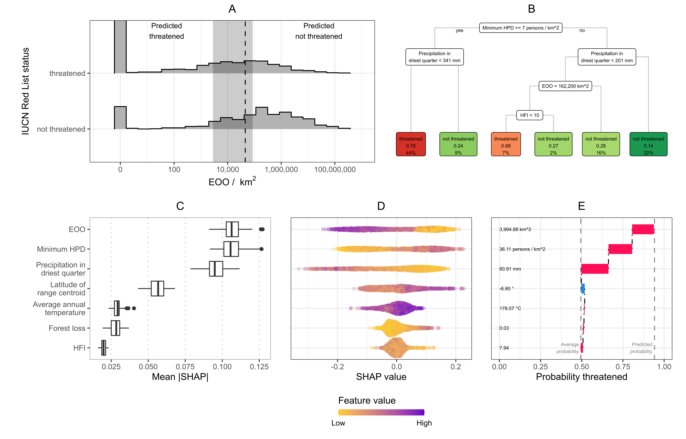

```{r setup, include=FALSE}
knitr::opts_chunk$set(echo=FALSE)
```

```{r libraries, include=FALSE}
library(here)
library(vroom)
library(tibble)
```

# Abstract

1. Assessing species' risk of extinction is a vital first step in setting conservation priorities. However, assessment endeavours like the IUCN Red List of Threatened Species still have significant gaps in their coverage of some taxonomic groups. Automated assessment (AA) methods are gaining popularity to rapidly fill in these gaps, taking advantage of improvements in computing and digitally available information.  However, the implicit choices made when developing and reporting automated assessment methods could prevent their successful adoption or, even worse, lead to poor allocation of conservation resources based on their predictions.

2. We systematically explored how the choice of data cleaning, taxonomic group, training sample, and automation method affected predicted threat status. We used occurrence records from GBIF to generate assessments for three distinct taxonomic groups using four different automated assessment methods. We measured each method's performance and coverage after applying increasingly stringent cleaning to the input occurrence data. We used these results to build evidence-based guidelines for developing and reporting automated assessments.

3. Automatically cleaned data from GBIF resulted in comparable performance to occurrence records cleaned manually by an expert. However, all types of data cleaning removed species and limited the coverage of automated assessments. This limitation was more severe for some groups of species than others. Overall, machine learning-based methods performed well on all taxonomic groups, even with minimal data cleaning.

4. We recommend using a machine learning-based method on minimally cleaned data to get the best compromise between performance and species coverage. However, our results demonstrate that the optimal data cleaning, training sample, and automation method depends on the focal group of species. Therefore, we recommend evaluating new AA methods across multiple groups and providing additional context with extinction risk predictions for users to make informed decisions.

# Introduction

Identifying and documenting which species are at risk of extinction is critical in setting priorities and acting to protect biodiversity. The IUCN Red List of Threatened Species (IUCN Red List) is the most widely accepted framework for assessing species’ global extinction risk. While the IUCN Red List covers the entirety of some groups (e.g. mammals and birds), only ~15%  of vascular plant species have been assessed [@IUCN2021a]. Such gaps in extinction risk knowledge [@Maxwell2020] may lead to inefficient or inappropriate conservation resource allocation. Automated assessment (AA) methods can help close this assessment gap [@NicLughadha2020]. However, systematic exploration of method choices is necessary to develop guidelines for the effective use of such methods.

Growing recognition of the need to speed up extinction risk assessments [@AlbaniRocchetti2020;@Bachman2019], advances in the digitisation of natural history collections [@Paton2020], and widening availability of biodiversity data [@LeBras2017] have spurred on the development of AA methods. Early examples focused on method development and often limited to relatively small taxonomic groups. For instance, Krupnick et al. [-@Krupnick2009] calibrated a rule-based method on 1,192 Hawaiian plant taxa, Bland et al. [-@Bland2015] compared how well different machine learning algorithms predicted the conservation status of 637 terrestrial mammals, and Darrah et al. [-@Darrah2017] explored the feasibility of using coarse-scale distribution data to predict the conservation status of 6,439 bulbous monocot species.

Recently, studies have developed and applied automated methods to larger datasets, including a continental-scale preliminary assessment of 22,036 species of the tropical African flora [@Stevart2019], an automated assessment of 13,190 species in the family Orchidaceae [@Zizka2020], and identification of global conservation priorities using automated assessments for over 150,000 land plants [@Pelletier2018]. These studies recognise some limitations of their approaches while still suggesting their new method can inform conservation prioritisation in specific situations. For example, Stevart et al. [-@Stevart2019] use their method to propose areas of High Conservation Value, and Pelletier et al. [-@Pelletier2018] propose global “geographic regions with the highest need of conservation efforts” based on their predictions. However, the complete information required for potential users to evaluate these methods’ performance, and therefore their proposed priorities, was not consistently reported [@Walker2020].

Given these high-stakes applications of AA methods, thorough consideration of these techniques’ benefits and limitations seems prudent. Potential misuses and misinterpretation [@Wearn2019] of AA methods could be avoided if developers fully explored and reported the implicit choices made when producing an AA method. Similarly, conservation biologists wishing to adopt one of these automated methods need clear guidelines about which methods to choose and how best to use them.

Specifically, four questions that we believe present fundamental barriers to the adoption and successful use of AA methods are:

1. **How clean does the occurrence data need to be?** Species occurrence records are extensively checked and geo-referenced during the Red List assessment process. This cleaning takes a significant amount of time. AA methods typically use automated cleaning on digitally available occurrence records to make this step more time-efficient. Given the well-documented issues with occurrence record data from online databases [@Meyer2016;@Paton2020;@Panter2020], this raises the question of how much data cleaning is necessary to generate useful automated assessments. A requirement for a high level of cleaning could limit the benefits of automated assessments. 

2. **How does the chosen study group affect data cleaning and AA method performance?**  Research interests and data availability often determine the group of species used to develop or apply an AA method. Studies reporting the performance of AA methods typically apply them to taxonomically or geographically limited groups [@Bland2015;@Stevart2019;@Zizka2020]. However, several different factors influence the number and quality of occurrence records for a particular species. For example, temperate species tend to have more occurrences than tropical species, and older records may have less precise or missing coordinates. Therefore, AA method choice may interact with occurrence record cleaning to make different methods more appropriate for particular species groups.   

3. **Which sample of assessments is most effective for training and evaluating AA methods?** A sample of species with published IUCN Red List assessments is necessary for measuring the performance of AA methods and training machine-learning-based methods. To maximise sample size, it usually comprises all assessed species in the group of interest. However, given the non-systematic way species are chosen for assessment [@NicLughadha2020], this sample may not represent all diversity in the chosen group. Furthermore, the number of species assessed in each Red List category is imbalanced, which can cause problems for machine-learning models. These issues raise questions about whether it is better to use a representative sample of assessed species and if strategies such as downsampling should be used to correct imbalances in assessed categories.

4. **When should one AA method be used over another?** Proposed AA methods fall into two broad groups: methods that use pre-determined thresholds and heuristics to mimic the IUCN Red List assessment process and methods that use machine learning to determine thresholds from data about previously assessed species. Both groups can deliver predictions with a high correspondence to manual IUCN Red List assessments, but each offers distinct advantages. The pre-determined rules that the first group uses can make their decisions more straightforward to interpret and troubleshoot than some popular machine learning techniques, such as random forests or neural networks. On the other hand, machine learning methods may be more robust to unclean data. The desired balance between predictive accuracy, ease of use, and interpretability may change depending on the available data, the group of species being assessed, and the intended users.

In this report, we systematically investigate the effect of data cleaning, study and sample group choice, and AA method by applying three different automated methods to generate preliminary assessments for three groups of flowering plant species with distinct occurrence record profiles (e.g. observations vs vouchered data, collected by generalists or specialists). We compare the performance of these methods on digitally available occurrence data that has undergone different levels of automated cleaning and a database of manually cleaned occurrences prepared for a monographic treatment. We also examine how the choice of training data set and the use of downsampling affect the performance of machine learning methods. In doing so, we develop a set of evidence-based recommendations for the use of AA methods and highlight important questions that remained unanswered. While we focus on applying AA methods to plants, we expect these guidelines to apply to other under-assessed groups, such as arthropods.

# Methods

## Data compilation

We chose three distinct groups of species to evaluate the effects and performance of choices in the automated assessment process. We selected these groups based on their geographic and taxonomic differences and their different collection histories. These groups were:

1. The widespread genus *Myrcia* in the Myrtaceae family (~750 spp), a woody genus confined to the Neotropics. Species in this group are notoriously difficult to identify, and after decades/centuries of taxonomic impediment, molecular analysis in conjunction with collaborative systematic study now allow a monographic approach. As a result, this dataset provides an example where records held by digital resources, such as GBIF, may contain significant taxonomic errors. Access to a monographer's database of *Myrcia* specimens allowed us to draw comparisons between data collected and cleaned by hand and automatically cleaned data.

2. All species in the family Orchidaceae (orchids). This family is large  (~30,000 spp) and has a small proportion of species assessed, reflecting a real-world example where rapid preliminary assessments could help focus more resources on potentially threatened species. It has also been used in a previous study by Zizka et al. [-@Zizka2019], allowing direct comparison with their results.

3. All species in the family Leguminosae (Fabaceae, legumes). Like orchids, the legumes are a large family (~22,000 spp), making up a significant amount of worldwide angiosperm diversity. Unlike Myrtaceae, the legumes are relatively well understood taxonomically and well-documented (e.g. Lewis et al. 2005). Legumes were also one focal group of the Sampled Red List Index (SRLI), which allowed us to compare the effect of training and evaluating AA methods on the representative sample of legumes used for the SRLI and all assessed legumes on the Red List.

We obtained checklists of accepted species for all three groups from the World Checklist of Vascular Plants [@WCVP2019]. The taxonomy of *Myrcia* occasionally differs due to ongoing revisionary study (e.g., Lima-Santos et al., unpublished data).

### Species assessments

We downloaded full assessments for the three species groups from the IUCN Red List of Threatened Species ([@IUCN2021]; hereafter Red List) and matched their names to the WCVP taxonomy using the Kew Names Matching Service (KNMS). While other tools exist for resolving taxon names, we chose KNMS because it provides a simple interface for directly matching names to records in WCVP. We manually resolved any unmatched names and updated the accepted names of assessments matched to homotypic synonyms. We removed all assessments matched to non-homotypic synonyms from our data set, as we could not be sure that the assessment would apply to the new species concept. We also removed assessments we were unable to match or that matched species outside our accepted species lists.

### Occurrence records

We downloaded occurrence records from GBIF for the entire taxonomic family to which each of our groups belong. As with the Red List assessments, we matched the taxon names of these occurrence records to the WCVP taxonomy. However, manually resolving unmatched names was infeasible in this case due to the number of names involved, so we used a more automated matching process (see Supplementary Materials).

For Myrcia, we retrieved occurrence records from the database prepared for a monographic treatment of *Myrcia s.l.* (E. Lucas, unpublished data). All specimens in this database were fully or partially verified by an expert in the genus. The georeferences of these specimens were checked or added as part of the monographic process. We passed the occurrence records from this database through the same name matching process as the GBIF occurrence records to catch any names that did not match the latest accepted name listed in WCVP.

## Occurrence record cleaning

To address our study's first question, we passed each set of occurrences through automated cleaning steps. These cleaning steps took two different approaches: filtering records lacking voucher specimens or representing duplicates and removing records based on their coordinates.

*Occurrence records in digital repositories can come from different sources, such as digitised specimens from natural history collections, photographs from citizen science platforms like iNaturalist, or field observations not supported by specimens or photos. Occurrence record sources vary in quality, with records based on preserved specimens, which allow verification and correction, often considered most reliable. Similarly, digital repositories may hold multiple entries for the same occurrence. While repeated entries may not significantly impact estimates of range size, such as the extent of occurrence, duplications could lead to biased estimates for other predictors of risk, such as mean human footprint.

```{r cleaning-steps}
cleaning_steps <-
  tribble(~`Type`, ~`Step`, ~`Description`,
          "Filtering", "1", "No filtering of occurrence records",
          "Filtering", "2", "Keep only records based on preserved specimens",
          "Filtering", "3", "Keep one of every record at exactly the same coordinates for each species",
          "Filtering", "4", "Apply both filter step 2 and 3",
          "Coordinate cleaning", "A", "No geography-based cleaning",
          "Coordinate cleaning", "B", "Remove occurrence records with coordinates at (0, 0)",
          "Coordinate cleaning", "C", "Remove occurrence records in the sea, at equal longitude and latitude, at country centroids, and at identified institutions",
          "Coordinate cleaning", "D", "Remove occurrence records outside each species native range as listed in POWO")

cleaning_steps %>%
  knitr::kable(
    caption="A description of each filtering and coordinate cleaning step examined. Filtering steps were applied separately, as described in the table, while coordinate cleaning steps were applied consecutively (i.e. step C was applied to a dataset already cleaned by step B)."
  )
```

Therefore, we applied filters to test whether removing occurrences based on anything other than preserved specimens or removing duplicated occurrences affected predictions of extinction risk. The combination of these filters led to four different filter levels (Table \@ref(tab:cleaning-steps)).

We chose our coordinate cleaning steps based on approaches taken by other studies of automated assessment (AA) methods, including the previously published Rapid Least Concern app [@Bachman2020]. We applied each step on top of the previous one to give increasing levels of coordinate cleaning (Table \@ref(tab:cleaning-steps)).

We passed all occurrence data sets through all permutations of these filtering and cleaning steps, except the occurrence records from the *Myrcia* monographic database. Applying these steps left us with 16 sets of occurrences records for each species group, plus an additional set of occurrences from the monographic database for *Myrcia*.

## Predicting threat status

We generated predictions of extinction risk for each of our taxonomic groups based on each of the 16 cleaned occurrence data sets, as well as the monographic database data set for our *Myrcia* group.

We made predictions with three different AA to explore the trade-offs between predictive performance, ease of use, and interpretability:

1. A threshold-based method, using the IUCN threshold on the extent of occurrence (EOO) for a threatened species, i.e. <20,000 km^2 [@IUCN2012]. The single, fixed threshold made this the easiest to use and interpret.

2. A decision tree with a single split (called a decision stump) on species' EOO. This simple machine learning model requires slightly more expertise than the IUCN threshold but remains readily interpretable.

3. A decision tree using predictors including EOO and measures of species' environment and exposure to threats. More splits and predictors than the decision stump make this method harder to use and understand. However, we limited the maximum number of splits to 5 to ensure it was still readily interpreted.

4. A random forest model using the same set of predictors as the decision tree . This method is the hardest to interpret and use but has shown good performance in previous studies predicting extinction risk [@Bland2015;@Darrah2017;@Lughadha2019;@Pelletier2018].

While it is possible to predict individual IUCN Red List categories, we chose to predict if a species is in the set of "threatened" IUCN categories. The high imbalance between the number of species in each category on the IUCN Red List could result in AA methods having a misleadingly high overall accuracy while performing poorly on the categories with fewer species. This problem could be especially severe for our smallest dataset, Myrcia. Following the IUCN definition, we grouped the Critically Endangered, Endangered, and Vulnerable categories into our threatened class [@IUCN2012]. We formed our non-threatened class from the Near Threatened and Least Concern categories. We treated Data Deficient species as unassessed, generating predictions for them from our AA methods, and excluded Extinct and Extinct in the Wild species from our study.

### Predictor preparation
All three methods used EOO as a predictor, calculated as the area in km^2 enclosed by the minimum convex polygon around each species' occurrence records [@Moat2020]. For the random forest model, we also used the latitude of range centroid and six environmental and threat-based predictors (Table \@ref(tab:predictor-table)).

```{r predictor-table}
predictor_table <-
  tribble(
    ~Predictor, ~`Used in`, ~Calculation, ~Source,
    "Extent of occurrence (EOO)", "IUCN-threshold, logistic regression, random forest", "Minimum convex polygon of occurrence records", "-",
    "Latitude of range centroid", "random forest", "Centroid of occurrence records", "-",
    "Minimum human population density (HPD)", "random forest", "Minimum value at occurrence records", "Raster from [@University2018]",
    "Human footprint index (HFI)", "random forest", "Mean value across occurrence records", "Raster from [@Venter2018]",
    "Forest loss", "random forest", "Mean of proportion of pixels with forest loss from 5km$^2$ buffer around occurrence record coordinates", "Raster from [@Hansen2013]",
    "Elevation", "random forest", "Maximum value at occurrence records", "Raster from [@Jarvis2008]",
    "Precipitation in the driest quarter", "random forest", "Mean value across occurrence records", "Raster from [@Fick2017]",
    "Average annual temperature", "random forest", "Mean value across occurrence records", "Raster from [@Fick2017]"
  )

predictor_table %>%
  knitr::kable(caption="Details of the predictors used in each method, how they were calculated, and their source.")
```

We calculated the six environmental and threat-based predictors by extracting values from the appropriate raster layers at each occurrence record (Table \@ref(tab:predictor-table)). To account for imprecisions in the raster data and record coordinates, we reprojected all raster layers to a resolution of 2.5 km and took the mean value from a 5 km buffer around each record's coordinates. We summarised these extracted values for each species using the mean for all predictor values except human population density. We used the minimum value for human population density, as we felt it was a better measure of threat across a species' range.

### Method evaluation

As the number of species with assessments for each taxonomic group was limited, we used 5-fold cross-validation repeated 10 times to train our decision stump and random forest models and get an estimate of their performances. We used 100 bootstrap resamples of the data with assessments to estimate the performance of our threshold-based method.

We evaluated all three methods using accuracy (proportion of species correctly classified), sensitivity (proportion of threatened species correctly classified), and specificity (proportion of non-threatened species correctly classified). We also calculated the true skill statistic (TSS), which is the sum of the sensitivity and specificity minus one. The TSS ranges between -1 and 1, where a score of 1 suggests the model is a perfect classifier and scores of zero or less suggest the model is no better than random guesses. In this way, TSS is a balanced measure of model performance.

## Training and evaluation sample choice
We examined three aspects of the training and evaluation sample - the representativeness, the size, and the balance of threatened to non-threatened species. We addressed the former by comparing our AA methods' performance on the representative sample of legumes assessed for the SRLI to their performance on all assessed legumes on the Red List.

We evaluated the effect of sample size when training our two machine-learning-based AA methods by splitting our datasets into 5 cross-validation folds, training our models on subsamples of the training, and measuring the subsequent performance on the validation sets. We increased the subsample size from 50 to 175 species in increments of 25. We also evaluated each model's performance with a combined training set of all three datasets.

We assessed the effect of sample balance on our two machine-learning-based AA methods by downsampling the training sets to balance the number of threatened and non-threatened species, as Pelletier et al. [-@Pelletier2018] did for their random forest models.

## Method interpretation

Following Zizka et al. [-@Zizka2020], we used logistic regression models to estimate the probability a prediction was correct based on the number of occurrence records available. These estimated probabilities can give additional context to assess the quality of a prediction for an unassessed species. These models comprised an intercept and single slope coefficient relating the base-10 logarithm of the number of occurrence records to the binary response of correct/not correct. For our decision stump and random forest AA methods, we fit these models to the validation set predictions for each evaluation fold of the cross-validation schemes. For the IUCN-threshold method, we fit the models to predictions for all assessed species.

We calculated SHapely Additive exPlanations (SHAPs), which estimate each predictor's contribution to individual predictions, to interpret predictions from the random forest model predictions [@Lundberg2017]. This calculation was computationally expensive, so we only calculated SHAPs for predictions for the orchid dataset made from minimally cleaned data (filtering step 1 and coordinate cleaning step A). We chose to examine our orchid predictions using SHAP because they have proven challenging to predict accurately than other plant groups [@NicLughadha2019].

## Software

*We performed our study using the R statistical computing language [@RCoreTeam2020]. A full list of packages is provided in the Supplementary Methods.We used the tidyverse family of packages [@Wickham2019] for data analysis and the tidymodels packages [@Kuhn2020] to train and apply our automated assessment methods. We use the sf package [@Pebesma2018] for geographic analysis, the raster [@Hijmans2020] and exactextractr [@DanielBaston2020] packages to handle raster data, CoordinateCleaner [@Zizka2019] to implement coordinate cleaning steps B and C, rCAT [@Moat2020] to calculate EOO, and the implementation of KernelSHAP from the shapper package [@Maksymiuk2020] to calculate SHAP values. We matched names through KNMS, queried taxonomic information in WCVP, and retrieved species' native ranges from Plants of the World Online (POWO) with the kewr package [@Walker2021].

# Results

## How clean does the occurrence data need to be?

We used the true skill statistic (TSS) as a balanced measure of performance for all method and cleaning comparisons. All methods performed relatively well across every filtering and cleaning step, with TSS remaining above 0.25 for all methods. Furthermore, the variation in TSS across CV folds suggests no clear change in performance with occurrence data cleaning (Fig. S1).

Despite this, there are some trends apparent in the methods' average performance (Fig. \@ref(fig:performance-grid)). The most apparent performance improvement is for the IUCN threshold method from coordinate-cleaning step A to D for all datasets except Orchids. The average TSS increased from 0.43 to 0.60 for *Myrcia*, 0.41 to 0.58 for SRLI legumes, and 0.53 to 0.61 for all legumes. For all groups analysed, filtering steps 2, 3, and 4 had a negligible impact on method performance. Therefore, the results discussed throughout relate to coordinate cleaning steps with filtering step 1 (no occurrence record filtering), unless otherwise stated.

Performance of all methods was slightly worse on the *Myrcia* monographic database than GBIF data with full coordinate cleaning. The random forest model's performance was worse on data from the monographic database (TSS = 0.59) than on minimally cleaned GBIF data (0.66).

## How does the chosen study group affect data cleaning and AA method performance?

The differences between the three datasets were apparent after downloading and name-matching the GBIF occurrence records with coordinates (corresponding to filtering and cleaning step 1A). As a single genus, the *Myrcia* dataset was the smallest at 48,262 records covering 654 accepted species. The orchid dataset was the next largest, with 4,282,221 records for 18,012 accepted species, followed by the legumes with 14,573,494 records covering 18,467 accepted species. 

### Data cleaning

Almost all *Myrcia* records were based on preserved specimens (93.9 %), while this proportion was much smaller for the orchid (14.3 %) and legume (15.2 %) datasets. Therefore, filtering step 2 (keeping preserved specimens only) removed most orchid and legume occurrence records but a small proportion of records from the *Myrcia* dataset. Filtering step 3 (removing records at duplicated coordinates) also profoundly affected each dataset's number of occurrences. This step reduced the *Myrcia* dataset to 31,298 unique occurrences (64.9 %), the legume dataset to 8,415,070 unique occurrences (57.7 %), and the orchid dataset to 1,912,129 unique occurrences (44.7 %).

The geographic cleaning steps removed fewer records than the filtering steps. Of the geographic cleaning steps, step C removed the most records from the orchid dataset (7.2 %), while step D removed the most records from the *Myrcia* (7.6 %) and legume datasets (16.4 %). Applying all filtering and geographic cleaning steps removed 42.9 % of *Myrcia* occurrences, 91.1 % of legume occurrences, and 91.2 % of orchid occurrences. Despite the large proportion of records removed from the *Myrcia* dataset, it still contained over twice the 10,823 records in the monographic database of *Myrcia* specimens.

[Despite comprising millions of records, the orchid dataset had the smallest median number of records per species (6) and the smallest median EOO (8,213 km$^2$). Species in the *Myrcia* dataset had more occurrence records (median records: 11.5) and larger ranges (median EOO: 46,635 km$^2$), while species in the legume dataset were the best recorded (median records: 31) and widest ranged (median range: 165,229 km$^2$).]

[The geographic cleaning steps exacerbated these differences (Fig. S2). Cleaning step D reduced median EOO most for all groups while filtering step C caused the largest drop in the median number of records. After applying all filtering and cleaning steps, the median number of occurrence records was 7 for *Myrcia* species, 16 for legume species, and 4 for orchid species. The corresponding median EOO values were 11,078 km2 for *Myrcia* species, 68,871 km2 for legume species, and 2,930 km2 for orchid species. Species in the monographic database of *Myrcia* occurrences had a median of 5 records and a median EOO of 4,485 km2 — both lower than the *Myrcia* dataset downloaded from GBIF after automatic cleaning.]

###  Species coverage

By removing occurrence records, the automated filtering (steps 2 to 4) and cleaning (steps B to D) also removed species from each study group (Fig. \@ref(fig:species-coverage)). Decreases in each study group's size reduced the number of labelled species available to train and evaluate the AA methods and limited the total proportion of species covered by the automated predictions.

Before matching the GBIF occurrence records, the *Myrcia* dataset comprised 769 species with non-Data Deficient (DD) Red List assessments for 254 (33.0 %). The orchid dataset comprised 30,479 species matched to 1,457 non-DD assessments (4.8 %), and the legume dataset comprised 22,123 species matched to 3,740 assessments (16.9 %), of which 844 were part of the SRLI. Predictions from the AA methods would increase the proportion of species with an evidence-based assessment of extinction risk to, at most, 85.0 % of *Myrcia* species, 83.5 % of legume species, and 60.8 % of orchid species.

```{r species-coverage, out.width="100%", fig.cap="The total number of species in each dataset with at least one occurrence record after applying each of the filtering and geographic cleaning steps. The dark red bars show the number of species covered by a non-Data Deficient IUCN Red List assessment, which we used to train and evaluate the AA methods."}
knitr::include_graphics("../figures/figure-1_cleaning-species-coverage.png")
```

All filtering and cleaning steps removed only a few species from the *Myrcia* dataset, except for cleaning step D, which removed 35 species. Filtering step 2 removed many species from both the legumes (246) and orchids (529) because most of their records were not based on preserved specimens. Coordinate cleaning steps C and D both removed the most species — step C removed 325 legume species and 612 orchid species, while step D removed a further 386 legume species and 635 orchid species.  

Applying all filtering and cleaning steps left 606 *Myrcia* species, 17,491 legume species, and 16,825 orchid species to use in the AA methods. Therefore, filtering and cleaning limited coverage of our predictions to 78.8 % of *Myrcia* species, 79.1 % of legume species, and 55.2 % of orchid species. Removing these species also reduced the number of species available to train and evaluate the AA methods to 241 *Myrcia* species, 3,581 legume species, and 1,145 orchid species. The monographic database covered 547 *Myrcia* species (71.1 % of accepted *Myrcia* species), 228 of which were available to train and evaluate the AA methods.

###  Performance

The IUCN threshold and decision stump methods performed worst on the orchid dataset, even with full geographic cleaning (0.32 and 0.29, respectively; Fig. \@ref(fig:performance-grid)). Both methods rely on a single threshold on species' EOO, and, given the small EOO of most orchid species, it is hard to separate threatened and non-threatened species without additional information. In contrast, the TSS of both methods improved after full geographic cleaning for the *Myrcia* dataset (IUCN threshold: 0.43 to 0.60; decision stump: 0.53 to 0.64). A smaller improvement was achieved on the legume dataset (IUCN threshold: 0.53 to 0.61; decision stump: 0.64 to 0.68).

```{r performance-grid, out.width="100%", fig.cap="Performance of automated assessment methods on datasets of Myrcia, orchid, and legume species that have undergone different levels of automated occurrence record filtering and coordinate cleaning. The results for Myrcia include a dataset of occurrences that an expert cleaned for use in a monographic treatment. For the legume datasets, the methods were trained and evaluated on all legume assessments on the IUCN Red List, and assessments carried out on a random sample of legume diversity as part of the Sampled Red List Index (SRLI)."}
knitr::include_graphics("../figures/figure-2_performance-grid.png")
```

The TSS was higher for the orchid dataset with the decision tree and random forest models, even with minimal geographic cleaning (decision tree: 0.49; random forest: 0.56). However, the TSS of corresponding models trained on the *Myrcia* (decision tree: 0.55; random forest: 0.69) and legume (decision tree: 0.65; random forest: 0.68) datasets was still higher.

## Which sample of assessments is most effective for training and evaluating AA methods?

The SRLI legume assessments had much fewer threatened than non-threatened assessments (11.8 %). Although all three machine-learning-based methods' accuracy was above 85 % on this training set (Fig. \@ref(fig:sample-choice)A), the models trained on the SRLI assessments suffered from very low sensitivity (decision stump: 0.09; decision tree: 0.35; random forest: 0.26). Downsampling improved the sensitivity of all machine-learning-based models trained on the SRLI assessments (decision stump: 0.80; decision tree: 0.75; random forest: 0.77), thereby increasing the TSS but reducing the accuracy slightly (Fig. \@ref(fig:sample-choice)A). Downsampling caused little to no improvement when trained on all legumes, or the  *Myrcia* and orchid training sets (Fig. S3), where the imbalance between classes was lower (20.5 %, 40.9 %, and 52.6 % threatened, respectively).

```{r sample-choice, out.width="100%", fig.cap="Exploration of AA method training and evaluation sample choice, comprising (A) the effect of downsampling on different performance metrics when automated assessment (AA) methods were trained and evaluated on a representative sample of legume species used for the Sampled Red List Index (SRLI), (B) the change in performance of machine-learning-based AA methods as they are trained on successively larger subsets of all legumes assessed on the IUCN Red List and those used for the SRLI, and (C) the difference in the proportion of unassessed species predicted threatened when AA methods are trained and evaluated on individual datasets and one combined dataset."}
knitr::include_graphics("../figures/figure-3_sample-choice_comparison.png")
```

Even with downsampling, all AA methods performed worse when trained on the SRLI legume assessments than all assessed legumes (Fig. S1). Training the three machine-learning-based methods on successively larger subsets of the two groups of legume assessments (Fig. \@ref(fig:sample-choice)B) indicated that this difference in TSS persisted regardless of training set size.

Training the machine-learning-based models on all groups combined caused little improvement in any of our evaluation metrics (Fig. S4). However, all three models' sensitivity was worse on the *Myrcia* species than when trained individually. This difference in sensitivity corresponded to a lower predicted level of threat in the unassessed *Myrcia* species when the datasets were pooled (Fig. \@ref(fig:sample-choice)C).

## When should one AA method be used over another?

All AA methods investigated achieved high predictive accuracy, regardless of the amount of cleaning applied to the occurrence records (Fig. S5A). The highest accuracies were achieved on the *Myrcia* and legume datasets (78 % - 89 %), while accuracy on the orchid dataset was lower (61 % - 79 %). However, the methods were often better at correctly predicting non-threatened species than threatened ones. The IUCN threshold method had the most marked imbalance across all datasets (Fig. S5B-C). Of the three AA methods investigated, our random forest model consistently had the highest TSS (Fig. \@ref(fig:performance-grid)).

[We used logistic regressions to estimate the probability of correctly classifying a species' extinction risk based on the number of occurrence records (Fig. S6; Table S1). With minimal data cleaning, the probability that a species with a single occurrence record was predicted correctly by the random forest model was 0.50 for legumes, 0.77 for *Myrcia*, and 0.74 for orchids.  The accuracy of all models increased with the number of specimens, with the steepest increase seen for the legume model (2.53, 95 % CI=[2.15, 3.04]). The dependence of method accuracy on the number of specimens was similar across AA methods for the orchid and legume datasets. For the *Myrcia* dataset, the IUCN threshold method had a lower probability of correctly classifying a species with a single occurrence record (0.50), and the odds increased more steeply with an increasing number of specimens (2.25, 95 % CI=[1.60, 3.11]).]

We explored different methods to interpret our machine learning models' behaviour using the orchid dataset, which has proven more challenging to predict than other plant groups. We summarised the decision stump model by extracting the learned EOO threshold. The average threshold across all CV folds was 30,848 km$^2$, higher than the IUCN threshold of 20,000 km$^2$, but the 95 % confidence interval was wide and ranged from 2,833 km$^2$ to 73,290 km$^2$ (Fig. \@ref(fig:explanations)A).

```{r explanations, out.width="100%", fig.cap="Methods for interpreting different machine-learning-based automated assessment methods. The decision stump model can be readily interpreted by (A) inspecting the classification boundary, with a 95 % confidence interval estimated by cross-validation. The decision tree provides (B) a simple flow-chart displaying the splits in the tree and the final decisions as leaves, labelled with the classification probability and percent of species cover by each leaf. We used SHapely Additive exPlanations (SHAPs) to interpret the behaviour of our random forest model. These values estimate the contribution of each predictor in the model to individual predictions. They can be aggregated to give (C) the overall importance of each predictor and (D) an indication of how the contribution of each predictor varies with that predictors value. Explanations of individual predictions can be displayed as (E) force plots to provide contextual information for a single prediction. All interpretations were made for models trained on the orchid dataset with minimal automated cleaning (step 1A). The individual explanation is for the species *Tridactyle phaeocephala*."}

```

We interpreted our decision tree model by inspecting the tree learned from one of the CV folds (Fig. \@ref(fig:explanations)B). This revealed that most threatened species (44 % of all species in the training set) were classified based on a human population density below 7.5 persons / km$^2$ and precipitation in the driest quarter below 35.3 mm. However, it also showed that this step only classified 79 % of these species correctly.

We used SHapely Additive exPlanations (SHAP) to interpret our random forest model. These provided individual explanations for predictions that could be aggregated to provide a global explanation of how the models were behaving overall.

As a global explanation, we calculated predictor importance for our orchid random forest model as the mean absolute SHAP for each predictor across all test predictions (Fig. \@ref(fig:explanations)C). The three most important predictors for the orchid dataset were HPD (mean absolute SHAP = 0.103), EOO (mean absolute SHAP = 0.101), and precipitation in the driest quarter (mean absolute SHAP = 0.086). To check for consistency, we also calculated the permutation predictor importance for all datasets (Fig. S7). The ranking of predictors for the orchid dataset was the same as the ranking from SHAP values; however, permutation importance indicated that EOO by far the most important predictor for the legume and *Myrcia* datasets.

We used the contribution of each predictor to each test prediction to plot a SHAP-based partial dependence plot (Fig. \@ref(fig:explanations)D). This plot revealed that our orchid model was behaving as we expected. More populated areas (higher HPD) increased the predicted probability of threat. In contrast, more precipitation in the driest quarter or larger ranges (higher EOO) reduced the predicted probability of threat.

We examined the contribution of each predictor to a single prediction, for *Tridactyle phaeocephala*, as an example of an individual explanation. The SHAP force plot (Fig. \@ref(fig:explanations)E) indicates that the low precipitation in the driest quarter (60.9 mm), small EOO (3,995 km$^2$), and relatively high human population density (36.1 persons / km$^2$) all pushed the probability of being threatened up to 0.89 from the average predicted probability of 0.49. However, this species is assessed as Least Concern on the IUCN Red List because, despite having a low EOO, there are no identified threats. The discrepancy between this species' predicted and assessed extinction risk suggests that we need to incorporate more detailed threat predictors or information about protected areas into our model.

# Discussion

The high-stakes applications of AA methods in conservation make it essential that developers thoroughly explore their implementation choices and that users can make informed decisions about the best method for their problem. Our study systematically investigated key AA method choices to build upon previous work and provide evidence-based guidelines for their use.

## How clean does the occurrence data need to be?

Given the well-documented issues with digitally available occurrence records [@Meyer2016;@Maldonado2015;@Zizka2019], it may seem reasonable to assume that AA methods will always perform better with carefully cleaned and georeferenced data. For example, Panter et al. [-@Panter2020] obtained more reliable preliminary assessments for threatened species in Bolivia after manually cleaning GBIF data.

Our results show that, despite these issues, AA methods using automatically cleaned data from GBIF give comparable or better performance than with hand-cleaned and georeferenced data. While we based our comparison on a relatively small set of around 200 species in the genus Myrcia, the high accuracy of other AA methods reported in the literature supports our findings [@Lughadha2019;@Zizka2020;@Stevart2019].

The performance of the IUCN threshold method was, however, contingent on how clean the data was. It only achieved its best results for our *Myrcia* and legume datasets on fully cleaned occurrence records. These results appear contrary to those reported by Zizka et al. [-@Zizka2020]. They found that ConR, another threshold-based AA method, had a similar accuracy at all levels of data cleaning when predicting the threat status of orchids. However, we also found that the level of cleaning made little difference to the performance of the IUCN threshold method on our orchid dataset. Therefore, we also expect the optimal level of cleaning for ConR, and other threshold-based AA methods, to depend on the group of taxa.

The machine learning methods we investigated were less sensitive to data cleanliness, suggesting they can make good-quality automated assessments with minimal occurrence data cleaning. The ability to use minimally cleaned data is important because we found a trade-off between using a highly cleaned set of occurrences records and generating predictions for as many species as possible. While all methods performed best with full automated cleaning, it removed species and limited coverage of our predictions to 80.7 % of *Myrcia* species, 77.4 % of legume species, and 54.6 % of orchid species with all cleaning steps applied. Other attempts at large-scale predictions of plant extinction risk have been similarly limited [@Zizka2020;@Pelletier2018].

However, whatever the chosen level of cleaning, a large proportion of plant species have few or no digitally available occurrence records. These species are mostly rare, range-restricted, and therefore likely to be threatened. This problem was most acute for the orchid dataset in our study, where we could make predictions for at most 60.2 % of species.

One solution, explored by Darrah et al. [-@Darrah2017], uses coarse-scale distribution data instead of occurrence records. While coarse-scale distribution data is available for almost all species [@POWO2019], many predictors used in AA methods are heterogeneous across regions. This approach, therefore, needs testing more broadly. Nonetheless, a means of handling species lacking any digitally available occurrence records is urgently needed. Otherwise, we risk ignoring many of the most threatened species when using AA methods, thereby underestimating the number or proportion of threatened species globally or in comparative analyses to inform conservation prioritisation.

## How does the chosen study group affect data cleaning and AA method performance?

Differences in performance between AA methods and automated cleaning steps in our study illustrate the importance of carefully choosing the protocol to fit a particular group of species. Furthermore, the full impact of a methodological choice, such as how occurrence records are cleaned, may not be apparent when assessed on a single taxonomic or geographic group, even one as large as the whole orchid family. 

These findings are in line with those of a recent paper by Zizka et al. [-@Zizka2020], comparing the effect of a wide range of automated cleaning steps on occurrence records across distinct taxonomic groups. They found that although automated cleaning removed 45 % of all their occurrence records, the amount dropped from any individual dataset was between 29.7 % and 90.3 %. As a result of the interaction between these cleaning differences and method performance, we recommend choosing multiple groups with distinct characteristics, as we have here. Doing so would identify which protocol works well for which groups and improve trust in any findings.

## Which sample of assessments is most effective for training and evaluating AA methods?

Using a machine-learning-based AA method raises the additional question of which sample of species is best to use for training. While the tendency might be to use as many species as possible for training, well-known gaps and biases in species selected for assessment may lead to poor predictive performance on unassessed species. 

Our results suggest that there is little benefit to using a sample of species designed to be representative of the diversity of the group of interest. Every model trained on all available legume assessments outperformed the same models trained only on species assessed as part of the SRLI. This discrepancy remained even when we trained the models on equal-sized subsamples of the two sets of assessments, suggesting the difference in performance was more likely due to the large imbalance between threatened and non-threatened species in the SRLI assessments than the datasets' different sizes. 

Pelletier et al. [-@Pelletier2018] downsampled the training sets for their random forest models to give equal numbers of species in each class. We found that downsampling improved the overall performance of all machine-learning-based models trained on the SRLI assessments at a small cost to predictive accuracy. However, downsampling made little difference to the performance on all other datasets, where the imbalance was lower.

Similarly, we saw no benefit to performance when we combined the *Myrcia*, legume, and orchid assessments into a single training set. We did, however, see a small drop in the ability of all methods to identify threatened *Myrcia* species and a corresponding decrease in the proportion of unassessed *Myrcia* species predicted as threatened. This decrease may cause issues for applications that use sub-groups of the predictions, such as setting assessment priorities based on taxonomic groups.

## When should one AA method be used over another?

We found that the random forest model was the best performing AA method for all species groups at every level of occurrence cleaning. However, all methods performed well and, with full automated cleaning of occurrence records, even the simplest IUCN threshold method achieved comparable performance.

Despite their high predictive accuracy, a random forest model may not always be the best choice. Other considerations include the expertise and time needed and the fact that the model's complexity makes it difficult to understand its behaviour. This opacity makes diagnosing problems with the method difficult, so it is hard to know how much to trust individual predictions [@Wearn2019].

Recent developments have made it easier to interpret black-box algorithms like random forests or neural networks (Molnar 2019).  One approach is SHapely Additive exPlanations (SHAP)[@Lundberg2017], which we used to gain insight into our random forest orchid model. Using SHAPs, we were able to identify the most important predictors and how the predicted probability of being threatened depended on each of our predictors. Furthermore, we were able to diagnose a possible deficiency in our choice of predictors by inspecting an explanation for an individual incorrect prediction.

However, SHAPs require additional computation and expertise that isn't necessary for understanding simpler methods like a decision tree model or the IUCN threshold. Nevertheless, given the potentially severe consequences of an incorrect prediction, we believe that it is essential to present additional context for predictions from all AA methods. While the exact context needs to be tailored to the intended application and user [@Suresh2021], it should include all calculated metrics or predictors and any fixed or learned thresholds.

More valuable, though, would be estimates of uncertainty for the predicted probabilities of being threatened. Methods for estimating uncertainty for machine learning models include the infinitesimal jackknife [@Wager2014] for random forest predictions and estimating uncertainty directly through the modelling algorithm, such as Bayesian Additive Regression Trees [@Chipman2012] or Bayesian Neural Networks [@ValentinJospin2020]. However, these methods would not necessarily address the most significant source of uncertainty for AA methods: the underlying occurrence records.

Despite growing understanding of the relative importance across whole datasets of issues such as imprecise or incorrect coordinates or misidentifications in occurrence records [@Maldonado2015;@NicLughadha2019], the goal of quantifying the resultant uncertainty for individual extinction risk predictions has yet to be attained [@Walker2020]. Such prediction-specific uncertainty estimates would be immensely beneficial, not only in the context of machine learning-based AA methods but for threshold-based ones as well.

# Conclusions

We have attempted to provide evidence-based answers that solve potential barriers to the successful adoption of automated assessment methods. Based on our findings, our answers are:

1. **How clean does the occurrence data need to be?** The level of cleaning necessary is dependent on the group of species examined, but good performance is possible using AA methods on occurrence records from digital resources with automated cleaning. We recommend using minimal cleaning in conjunction with a machine learning-based AA method for the best species coverage. However, if a threshold-based method is preferred, more stringent automated cleaning is necessary for best performance.

2. **How does the chosen study group affect data cleaning and AA method performance?** The performance of AA methods and the necessary cleaning level are highly dependent on the group of species examined. We, therefore, recommend evaluating AA methods on different species groups with distinct characteristics. When making automated assessments, the focal group of species is often pre-determined. In these cases, we recommend selecting an AA method and cleaning protocol that has worked well on a similar group of species or evaluating different protocols to find the best for the specific problem.

3. **Which sample of assessments is most effective for training and evaluating AA methods?** Our results suggest that the balance of threatened to non-threatened species is more important than the number of assessments used to train a machine-learning-based AA method. When making large-scale predictions, the training set should match the scope of the task, and the performance should be evaluated on subsets of species to identify any biases in the predictions. 

4. **When should one AA method be used over another?** Our random forest model consistently achieved the best results across all groups in our study, at all levels of data cleaning. However, the more straightforward methods investigated attained comparable performance in some settings. Ultimately, the most appropriate AA method will depend on the intended application and the resources available.

As well as providing answers, our study raised some questions that present possible challenges in using AA methods:

* **How should we handle species with no available occurrence records?**  A large proportion of plant species have few or no digitally available occurrence records. This problem limits the applicability of AA methods and runs the risk of allowing many of the most threatened species to drop out of the assessment pipeline. More work is needed to make AA methods widely applicable or develop robust rules for handling species they cannot address.

* **How do we quantify uncertainty in a single species' prediction?** Presenting automated assessment predictions alongside an estimate of their uncertainty would allow them to form the basis for more effective decisions, as well as open up new avenues for research. While approaches exist for estimating the uncertainty in machine learning predictions, there may be more value in quantifying the uncertainty resulting from imprecisions in the underlying occurrence data.

By following the recommendations of our study and tackling these challenges, conservation biologists can have increased confidence in adopting automated assessment methods as powerful tools to scale up assessments and close gaps in coverage.

# References