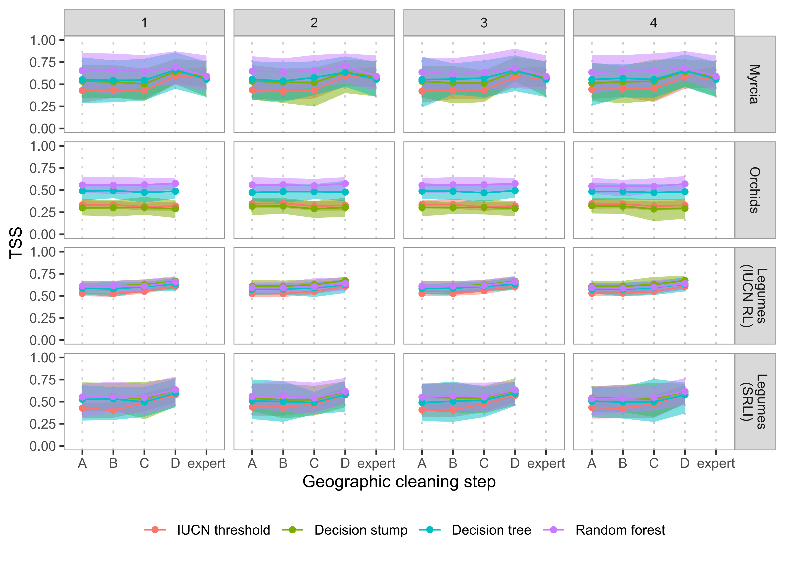
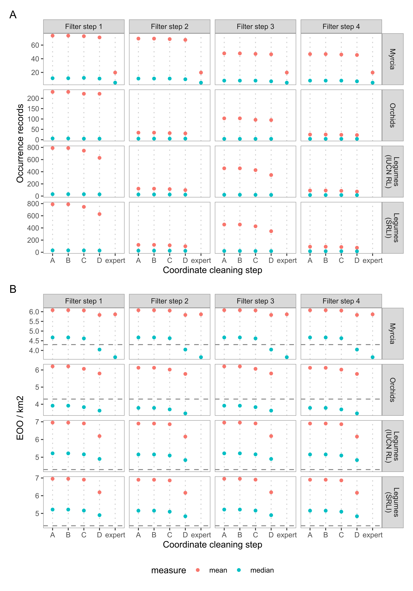
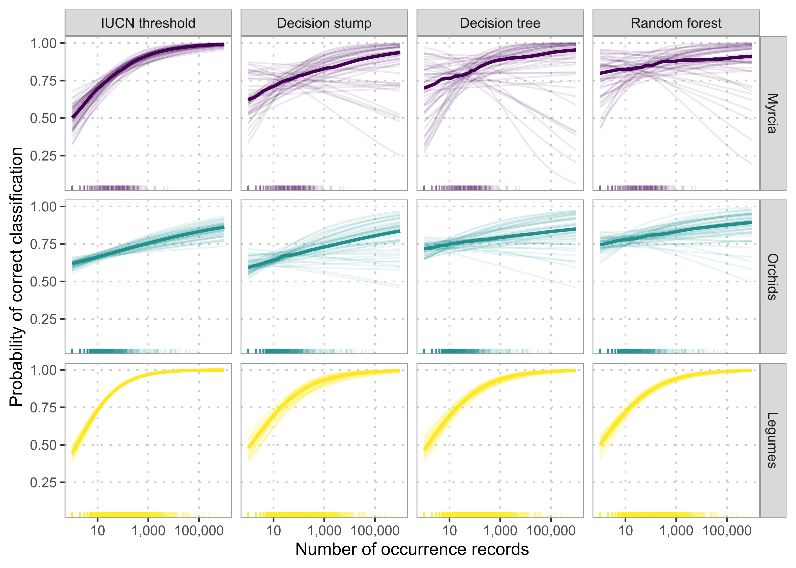
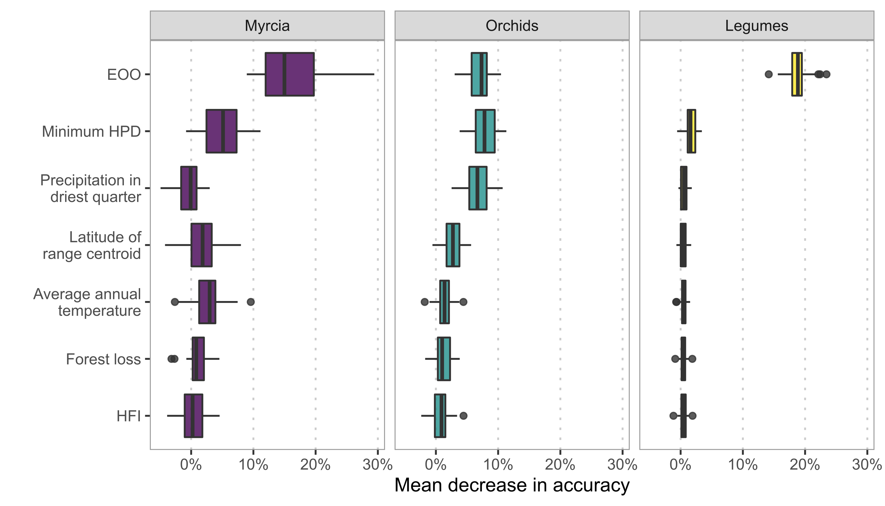

  
```{r setup, include=FALSE}
knitr::opts_chunk$set(echo = FALSE)

library(here)
library(dplyr)
library(vroom)
```

# Supplementary Methods

## Automated name matching
When matching IUCN Red List assessment names to WCVP, we manually resolved unmatched names to ensure we had as many assessed species as possible. This manual matching was infeasible when matching occurrence record names from GBIF, due to the number of names. Therefore, we used a more automated process.

We first submitted taxon names with their author strings to the Kew Names Matching Service (KNMS; [@RBGKew]). We then re-submitted any unmatched names, this time without the author strings. The KNMS can return multiple matches for a single name, which we resolved in both these steps by taking only the accepted names from multiple matches. If no accepted name was returned, we took the homotypic synonyms. If no accepted name or homotypic synonym was returned or multiple matches remained after filtering for these, we returned no match for that name. We then removed all occurrence records with unmatched names from our data sets.

## Predictor preparation
All four methods used EOO as a predictor, calculated as the area in $km^2$ enclosed by the minimum convex polygon around each species' occurrence records [@Moat2020]. For the decision tree and random forest models, we also used latitude of range centroid and six environmental and threat-based predictors (Table \@ref(tab:predictor-table)).

We calculated six environmental and threat-based predictors by extracting values from appropriate raster layers at each occurrence record (Table \@ref(tab:predictor-table)). To account for imprecisions in raster data and record coordinates, we reprojected all raster layers to a resolution of 2.5 km and took the mean value from a 5 km radius buffer around each record's coordinates. We summarised these extracted values for each species across occurrence records, or the minimum or maximum at occurrence records (Table \@ref(tab:predictor-table)). We used the minimum value for human population density, as we consider it a better measure of threat across a species' range.

### Evaluation metrics

We evaluated all AA methods using accuracy (proportion of species correctly classified), sensitivity (proportion of threatened species correctly classified), and specificity (proportion of non-threatened species correctly classified). We also calculated the true skill statistic (TSS), which is the sum of the sensitivity and specificity minus one. The TSS ranges between -1 and 1, where a score of 1 suggests the model is a perfect classifier and scores of zero or less suggest the model is no better than random guesses. In this way, TSS is a balanced measure of model performance. Comparison or discussion of performance is based on TSS, unless another metric is specified.

## Software

We performed our study using the R statistical computing language [@RCoreTeam2020]. We used the tidyverse family of packages [@Wickham2019] for data analysis and the tidymodels packages [@Kuhn2020] to train and apply our automated assessment methods. We use the sf package [@Pebesma2018] for geographic analysis, the raster [@Hijmans2020] and exactextractr [@DanielBaston2020] packages to handle raster data, CoordinateCleaner [@Zizka2019] to implement coordinate cleaning steps B and C, rCAT [@Moat2020] to calculate EOO, and the implementation of KernelSHAP from the shapper package [@Maksymiuk2020] to calculate SHAP values. We matched names through KNMS, queried taxonomic information in WCVP, and retrieved species' native ranges from Plants of the World Online (POWO) with the kewr package [@Walker2021].

```{r tss-comparison, out.width="100%", fig.cap="Comparison of true skill statistic (TSS) for each automated assessment (AA) method on each study group as the occurrence data is filtered and cleaned."}

```

```{r cleaning-comparison, out.width="100%", fig.cap="The mean and median (A) number of occurrence records and (B) extent of occurrence (EOO) for species in each data set as the occurrence data is filtered and cleaned. The dashed line in (B) represents the IUCN Red List threshold on EOO for a threatened species."}

```

```{r downsampling-comparison, out.width="100%", fig.cap="The performance of each AA method on each group with and without downsampling to even the balance of threatened to non-threatened species in the dataset."}
knitr::include_graphics("../figures/figure-s3_downsampling-comparison.png")
```

```{r groupwise-comparison, out.width="100%", fig.cap="A comparison of the performance of AA methods on each study group when trained on all three datasets combined to the performance when trained on each dataset individually."}
knitr::include_graphics("../figures/figure-s4_group-comparison.png")
```

```{r detailed-performance-comparison, out.width="100%", fig.cap="Comparison of performance of AA methods on each study group as the occurrence data is filtered and cleaned, measured by (A) accuracy, (B) sensitivity, and (C) specificity."}
knitr::include_graphics("../figures/figure-s5_detailed-performance-comparison.png")
```

```{r accuracy-model-comparison, out.width="100%", fig.cap="The relationship between predicted probability of being threatened and number of occurrence records estimated by logistic regression models fit to the test set predictions of each AA method. Faint lines indicate the estimates for models fit to each cross-validation fold used to train the AA methods and bold lines show the median relationship. The lines at the bottom of each plot show the datapoints used to fit the models."}

```


```{r permutation-importance, out.width="100%", fig.cap="Mean decrease in accuracy attributable to each predictor in our random forest models as estimated by permutation feature importance."}

```

```{r predictor-table}
predictor_table <-
  tribble(
    ~Predictor, ~`Used in`, ~Calculation, ~Source,
    "Extent of occurrence (EOO)", "IUCN-threshold, logistic regression, random forest", "Minimum convex polygon", "-",
    "Latitude of range centroid", "random forest", "Centroid of occurrence records", "-",
    "Minimum human population density (HPD)", "random forest", "Minimum value", "Raster from [@University2018]",
    "Human footprint index (HFI)", "random forest", "Mean value", "Raster from [@Venter2018]",
    "Forest loss", "random forest", "Mean of proportion of pixels with forest loss from 5km$^2$ buffer around occurrence records", "Raster from [@Hansen2013]",
    "Elevation", "random forest", "Maximum value", "Raster from [@Jarvis2008]",
    "Precipitation in the driest quarter", "random forest", "Mean value", "Raster from [@Fick2017]",
    "Average annual temperature", "random forest", "Mean value", "Raster from [@Fick2017]"
  )

predictor_table %>%
  knitr::kable(caption="Details of the predictors used in each method, how they were calculated, and their source.")
```

```{r accuracy-model-table, warning=FALSE, message=FALSE}
d <- vroom(here("output/figures/table-s1_accuracy-model-table.csv"))

d %>%
  select("Group"="group", "Model"="model", "Term"="term",
         "Estimate"=".estimate", "Lower 95% CI"=".lower",
         "Upper 95% CI"=".upper") %>%
  knitr::kable(digits=2,
               caption="Table S2. Model coefficients for logistic regression models relating the accuracy of the AA methods to the number of occurrence records for a species. The models were fit with the formula $log(\\hat{p}_i / 1 - \\hat{p}_i) = \\alpha + \\beta log_{10}(occurrences)$ and all coefficients are shown in their exponentiated form. Therefore, the intercept terms can be interpreted as the odds that a species with one occurrence record is predicted correctly, while the slope term can be interpreted as the multiplicative increase in the odds that a species is predicted correctly with each increase in the order of magnitude of the number of occurrences.", escape=FALSE)
```

# References