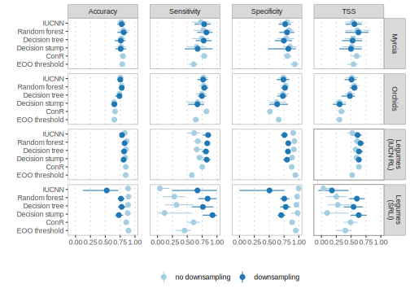

  
```{r setup, include=FALSE}
knitr::opts_chunk$set(echo = FALSE)
```

```{r tss-comparison, out.width="100%", fig.cap="TSS comparison"}
knitr::include_graphics("../figures/figure-s1_tss-comparison.svg")
```

```{r cleaning-comparison, out.width="100%", fig.cap="cleaning comparison"}
knitr::include_graphics("../figures/figure-s2_cleaning-comparison.svg")
```

```{r downsampling-comparison, out.width="100%", fig.cap="downsampling comparison"}

```

```{r groupwise-comparison, out.width="100%", fig.cap="groupwise performance comparison"}

```

```{r detailed-performance-comparison, out.width="100%", fig.cap="detailed performance comparison"}

```

```{r accuracy-model-comparison, out.width="100%", fig.cap="accuracy logistic regressions"}
knitr::include_graphics("../figures/figure-s6_accuracy-model-comparison.svg")
```


```{r permutation-importance, out.width="100%", fig.cap="accuracy logistic regressions"}
knitr::include_graphics("../figures/figure-s7_rf-permutation-importance.svg")
```

```{r accuracy-model-table, warning=FALSE, message=FALSE}
d <- vroom(here("output/results/table-s1_accuracy-model-table.csv"))

d %>%
  select("Group"="group", "Model"="model", "Term"="term",
         "Estimate"=".estimate", "Lower 95% CI"=".lower",
         "Upper 95% CI"=".upper") %>%
  knitr::kable(digits=2,
               caption="Table S1. Model coefficients for logistic regression models relating the accuracy of the AA methods to the number of occurrence records for a species. The models were fit with the formula $log(\\hat{p}_i / 1 - \\hat{p}_i) = \\alpha + \\beta log_{10}(occurrences)$ and all coefficients are shown in their exponentiated form. Therefore, the intercept terms can be interpreted as the odds that a species with one occurrence record is predicted correctly, while the slope term can be interpreted as the multiplicative increase in the odds that a species is predicted correctly with each increase in the order of magnitude of the number of occurrences.", escape=FALSE)
```