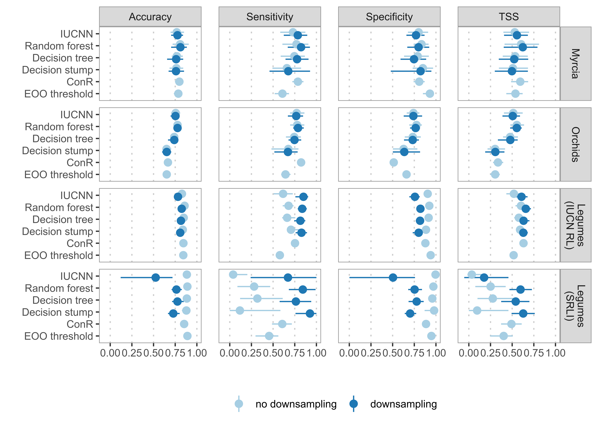
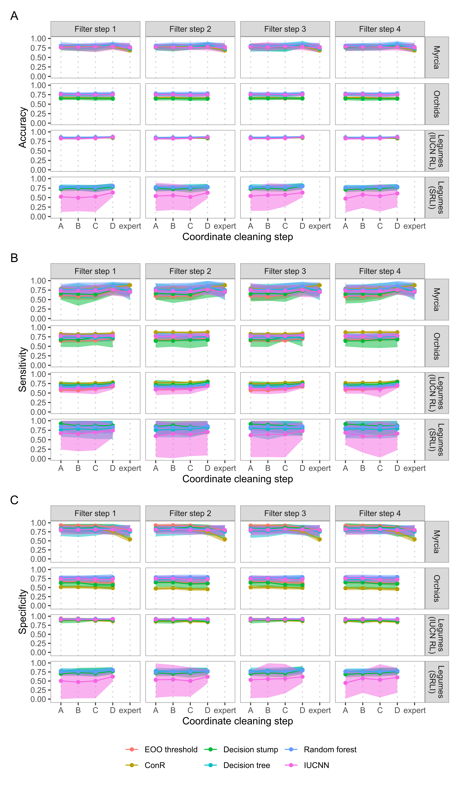

  
```{r setup, include=FALSE}
knitr::opts_chunk$set(echo = FALSE)

library(here)
library(dplyr)
library(vroom)
```

# Supplementary Methods

## Automated name matching
We matched IUCN Red List assessment names and GBIF occurrence record names to WCVP using an automated process.

We first matched taxon names directly to names in a download of WCVP. Any unmatched names, we submitted with their author strings to the Kew Names Matching Service (KNMS; [@rbg_kew_kew_2018]). We then re-submitted any remaining unmatched names, this time without the author strings. The KNMS can return multiple matches for a single name, which we resolved in both these steps by taking only the accepted names from multiple matches. If no accepted name was returned, we took the homotypic synonyms. If no accepted name or homotypic synonym was returned or multiple matches remained after filtering for these, we returned no match for that name. We then removed all occurrence records with unmatched names from our data sets.

## Predictor preparation
All six methods used EOO as a predictor, calculated as the area in km^2 enclosed by the minimum convex polygon around each species’ occurrence records [@moat_rcat_2020]. For the decision tree, random forest, and IUCNN models, we also used latitude of range centroid and six environmental and threat-based predictors (Table S9).

We calculated the six environmental and threat-based predictors by extracting values from appropriate raster layers at each occurrence record (Table S9). To account for imprecisions in raster data and record coordinates, we reprojected all raster layers to a resolution of 2.5 km and took the mean value from a 5 km radius buffer around each record’s coordinates. We summarised these extracted values for each species across occurrence records, or the minimum or maximum at occurrence records (Table S9). We used the minimum value for human population density, as we consider it a better measure of threat across a species’ range.

## Implementation notes
All models were trained and evaluated using the tidymodels [@kuhn_tidymodels_2020] framework, including ConR and IUCNN, which we adapted to fit our workflow. We used the ConR package [@dauby_conr_2017] to calculate EOO, AOO, and number of locations for the ConR method but used rCAT [@moat_rcat_2020] to calculate EOO for all other methods. EOO calculation in ConR includes a step to check if all occurrences are on a straight line, which involves calculating the pairwise correlation matrix between all occurrence coordinates. This step significantly slows the calculation and can cause memory errors for species with many occurrences. As such, we used rCAT to calculate EOO for our ConR method when a species had more than 50,000 unique coordinates.

We developed our own package to provide wrappers to use the two criteria-explicit methods and IUCNN with tidymodels. Details of these implementations can be found at https://barnabywalker.github.io/tidyassessments/.

Within tidymodels, we used the rpart implementation of decision trees for our decision stump and decision tree models and the randomForest implementation for our random forest model. Details of our model specifications can be found at https://github.com/barnabywalker/guidelines-for-automated-assessments.

## Evaluation metrics

We evaluated all AA methods using accuracy (proportion of species correctly classified), sensitivity (proportion of threatened species correctly classified), and specificity (proportion of non-threatened species correctly classified). We also calculated the true skill statistic (TSS), which is the sum of the sensitivity and specificity minus one. The TSS ranges between -1 and 1, where a score of 1 suggests the model is a perfect classifier and scores of zero or less suggest the model is no better than random guesses. In this way, TSS is a balanced measure of model performance. Comparison or discussion of performance is based on TSS, unless another metric is specified.

## Hyperparameter tuning

Both the random forest and neural network models have hyperparameters, which we tuned using nested cross-validation [@raschka_model_2020]. For each fold in our evaluation scheme (10 repeats of 5-folds), we split the training set into 3 inner cross-validation folds, on which we evaluated candidate hyperparameter values and chose the best based on the log-loss of the resulting models. We then trained and evaluated a model using the best hyperparameter values for each outer evaluation fold. We tuned the number of trees and the number of predictors randomly selected at each split in the tree for our random forest models, and the layers, amount of dropout, and number of epochs for our neural network. Following Zizka et al. [-@zizka_automated_2020], we tried three configurations of layers (a single layer with 30 hidden units; two layers with 40 then 20 units; three layers with 50, then 30, then 10 units) and tuned the number of epochs by training each network for 1000 total epochs and selecting the best for the final model fit.

## Block cross-validation

Further, species are often assessed for the Red List as part of an effort focusing on a particular taxonomic or geographic group [@nic_lughadha_extinction_2020], leaving many groups of plants completely unassessed. Random cross-validation may give a biased estimate of performance in this case. We, therefore, additionally compared performance of all machine-learning based methods evaluated by taxonomic block cross-validation. In block cross-validation entire groups of examples are either in the training or test set. For our taxonomic block cross-validation, legume and orchid species were assigned to the training or test set of each of 10 folds based on their genus and Myrcia species to the training and test set of each of 5 folds based on their section according to Lucas et al. [-@lucas_new_2018]. For models trained on all three groups combined, we used 3 folds and held out one of the groups as the test set for each fold.

## Software

We performed our study using the R statistical computing language [@r_core_team_r_2020]. We used the tidyverse family of packages [@wickham_welcome_2019] for data analysis and the tidymodels packages [@kuhn_tidymodels_2020] to train and apply our automated assessment methods. We use the sf package [@pebesma_simple_2018] for geographic analysis, the raster [@hijmans_raster_2020] and exactextractr [@baston_exactextractr_2020] packages to handle raster data, CoordinateCleaner [@zizka_coordinatecleaner_2019] to implement coordinate cleaning steps B and C, rCAT [@moat_rcat_2020] to calculate EOO, ConR [@dauby_conr_2017] to calculate the ConR parameters, the fastshap package [@greenwell_fastshap_2022] to calculate approximate SHAP values, and the vip package [@greenwell_variable_2020] to calculate permutation predictor importance. We matched names through KNMS, queried taxonomic information in WCVP, and retrieved species’ native ranges from Plants of the World Online (POWO) with the kewr package [@walker_caution_2020].

```{r species-coverage, out.width="100%", fig.cap="Number of species in each dataset with at least one occurrence record after applying each filtering and cleaning step. Filtering and cleaning reduce the number of species available for training and evaluation, and the proportion of species covered by automated assessments. Dark red bars show the number of species with non-Data Deficient IUCN Red List assessments, used to train and evaluate AA methods."}

```

```{r tss-comparison, out.width="100%", fig.cap="Comparison of true skill statistic (TSS) for each automated assessment (AA) method on each study group as the occurrence data is filtered and cleaned."}

```

```{r downsampling-comparison, out.width="100%", fig.cap="The performance of each AA method on each group with and without downsampling to even the balance of threatened to non-threatened species in the dataset."}

```

```{r groupwise-comparison, out.width="100%", fig.cap="A comparison of the performance of AA methods on each study group when trained on all three datasets combined to the performance when trained on each dataset individually."}
knitr::include_graphics("../figures/figure-s4_group-comparison.png")
```

```{r detailed-performance-comparison, out.width="100%", fig.cap="Comparison of performance of AA methods on each study group as the occurrence data is filtered and cleaned, measured by (A) accuracy, (B) sensitivity, and (C) specificity."}

```

```{r permutation-importance, out.width="100%", fig.cap="Mean decrease in accuracy attributable to each predictor in our random forest models as estimated by permutation feature importance."}

```

```{r shap-criteria-importance, out.width="100%", fig.cap="Contribution of each predictor in the random forest model to the predicted probability of being threatened for orchid species with threatened assessments citing criterion A and orchid species with threatened assessments not citing criterion A, as measured by the mean absolute SHapley Additive explanation."}

```

```{r predictor-table}
predictor_table <-
  tribble(
    ~Predictor, ~`Used in`, ~Calculation, ~Source,
    "Extent of occurrence (EOO)", "EOO-threshold, ConR, decision stump, decision tree, random forest, IUCNN", "Minimum convex polygon", "-",
    "Area of occupancy (AOO)", "ConR", "Area covered by the number of occupied 2km$^2$ grid-cells", "-",
    "Number of locations", "ConR", "Approximated by counting the number of occupied 10km$^2$ grid-cells", "-",
    "Latitude of range centroid", "decision tree, random forest", "Centroid of occurrence records", "-",
    "Minimum human population density (HPD)", "decision tree, random forest", "Minimum value", "Raster from [@ciesin_gridded_2018]",
    "Human footprint index (HFI)", "decision tree, random forest", "Mean value", "Raster from [@venter_last_2018]",
    "Forest loss", "decision tree, random forest", "Mean of proportion of pixels with forest loss from 5km$^2$ buffer around occurrence records", "Raster from [@hansen_high-resolution_2013]",
    "Elevation", "decision tree, random forest", "Maximum value", "Raster from [@fick_worldclim_2017], derived from [@farr_shuttle_2007]",
    "Precipitation in the driest quarter", "decision tree, random forest", "Mean value", "Raster from [@fick_worldclim_2017]",
    "Average annual temperature", "decision tree, random forest", "Mean value", "Raster from [@fick_worldclim_2017]"
  )

predictor_table %>%
  knitr::kable(caption="Details of the predictors used in each method, how they were calculated, and their source.")
```

```{r criteria-table, warning=FALSE, message=FALSE}
criteria_table <- vroom(here("figures/table-s2_criteria-table.csv"))

criteria_table %>%
  knitr::kable(digits=2, caption="A breakdown of the proportion of species in each group with assessments citing each of the IUCN Red List Criteria. Criteria are only required for species assessed as threatened, and assessments may cite more than one criterion.")
```

# References